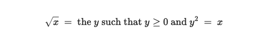
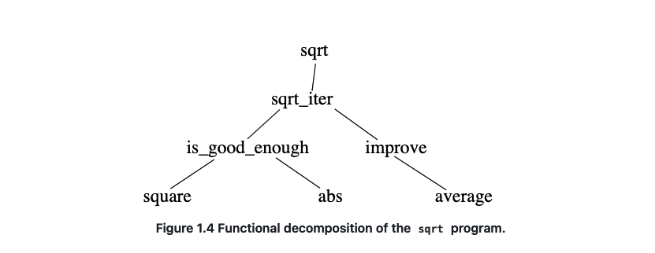
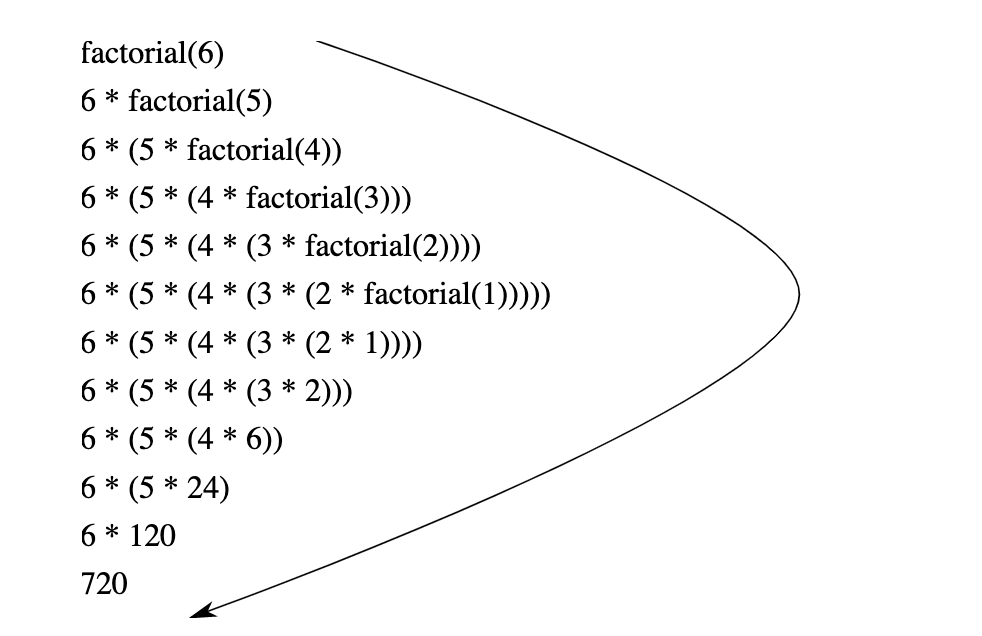
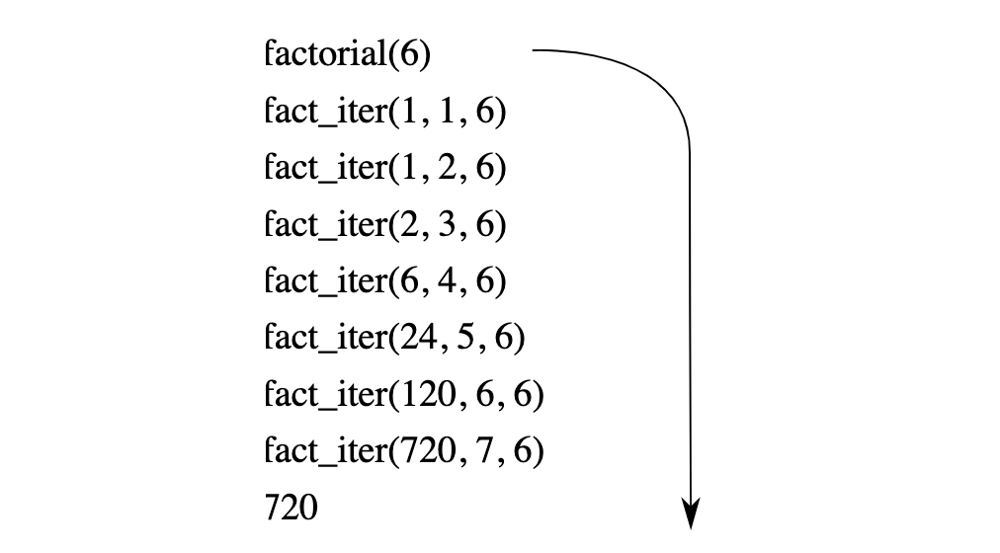
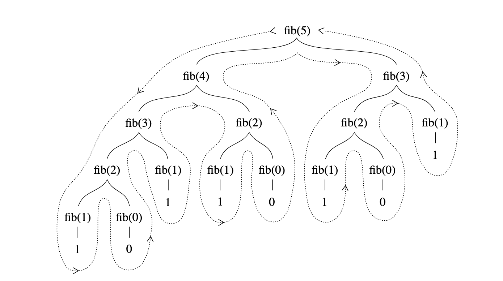

# Building Abstractions with Functions

## The Elements of Programming

* primitive expressions
* mean of combination
* means of abstraction

Function and Data

> Data is "stuff" that we want to manipulate, and Functions are descriptions of the rules
>
> for manipulating the data.

### Expressions

``` js
486;

137 + 349; // 486

1000 - 334; // 666

5 * 99; // 495

10 / 4; // 2.5

2.7 + 10; // 12.7

```

Expressions such as these, which contain other expressions as components, are called combinations.

``` js
(3 * 5) + (10 - 6); // 19

3 * 5 + 10 / 2;
// stands for 
(3 * 5) + (10 / 2);

1 - 5 / 2 * 4 + 3;
// stands for 
(1 - ((5 / 2) * 4)) + 3;

3 * 2 * (3 - 5 + 4) + 27 / 6 * 10;

3 * 2 * (3 - 5 + 4)
+
27 / 6 * 10;

```

Reads a statement typed by the user, evaluates the statement, and prints the result.


### Naming and the Environment

A critical aspect of a programming language is the means it provides for using names to refer to computational objects, and our first such means are constants.

``` js
const size = 2;
```

caused the intercepter to associate the value 2 with name *size*.Once the name *size* has been associated with the number2, we can refer to the value 2 by name

``` js
size;

// 2

5 * size;

// 10
```

The interpreter needs to execute the constant declaration for *size* before the name *size* can be used in an expression. 

``` js
const size = 2;
5 * size;

const pi = 3.14159;
const radius = 10;
pi * radius * radius;
// 314.159

const circumference = 2 * pi * radius;

circumference;
// 62.8318
```

Constant declartion is our language's simplest means of abstraction, for it allows us to use simple names to refer to the result of compound operations, such as the *circumference* computed above. In general, computational objects may have very complex structures, and it would be extremely inconvenient to have to remember and repeat their details each time we want to use them. Indeed, complex programs are constructed by building, step by step, computational objects of increasing complexity.

It should be clear that the possibility of associating values with names and later retrieving them means that the interpreter must maintain some sort of memory that keeps track of the name-object pairs.This memory is called the environment.


### Evaluating Operator Combinations

To evaluate an operator combination, do the following:

1. Evaluate the operand expressions of the combination 
2. Apply the function that is denoted by the operator to the arguments that are the values of the operands

First, observe that the first step dictates that in order to accomplish the evaluation process for a combination we must first perform the evaluation process on each operand of the combination .Thus, the evaluation rule is *recursive* in nature; that is , it includes, as one of its steps, the need to invoke the rule itself.

Notice how succinctly the idea of recursion can be used to express what, in the case of a deeply nested combination ,would otherwise be viewed as a rather complicated process.

``` js
(2 + 4 * 6) * (3 + 12)
```

We can obtain a picture of this precess by representing the combination in the form of a tree.

Each combination is represented by a node with branches corresponding to the operator and the operands of the combination stemming from it.The terminal nodes (that is, nodes with no branches stemming from them) represent either operators or numbers.Viewing evaluation in terms of the tree, we can imagine that the values of the operands percolate upward, starting from the terminal nodes and then combining at higher and higher levels.


Observe that the repeated application of the first step brings us to the point where we need to evaluate, not combination , but primitive expressions such as numerals or names. We take care of the primitive cases by stipulating that

* the values of numerals are the numbers that they name, and 
* the values of names are the objects associated with those names in the environment

The key point to notice is the role of the environment in determining the meaning of the names in expressions. In an interactive language such as JavaScript, it is meaningless to speak of the value of an expression such as x + 1 without specifying any information about the environment that would provide a meaning for the name x. The general notion of the environment as providing a context in which evaluation takes place will play an important role in our understanding of program execution.

The purpose of the declaration (const x = 3) is precisely to associate x with a value.(That is, const x = 3; is not a combination.)

The word const is a keyword in JS. Keywords carry a particular meaning, and thus cannot be used as names.

A keyword or a combination of keywords in a statement instructs the JavaScript interpreter to treat the statement in a special way.

Each such syntactic from has its own evaluation rule. The various kinds of statements and expressions (each with its associated evaluation rule) constitute the syntax of the programming language.


### Compound Functions

We have identified in JavaScript some of the elements that must appear in any powerful programming language:

* Numbers and arithmetic operations are primitive data and functions
* Nesting of combinations provides a means of combining operations
* Constant declarations that associate means with values provide a limited means of abstraction

Now we will learn about function declarations, a much powerful abstraction technique by which a compound operation can be given a name and then referred to as a unit.

We begin by examining how to express the idea of "squaring". We might say, "To square something, take it times itself."This is expressed in our language as

``` js
function square(x) {
  return x * x;
}
```

``` txt
function square(    x   ) { return x    *     x; }
//  ^       ^       ^         ^    ^    ^     ^
// To    square something,  take   it times itself.
```

The simplest form of a function declaration is 

``` txt
function name(parameters) { return expression; }
```

Having declared *square*, we can now use it in a function application expression

``` js
square(21);
// 441
```

Function applications are-after operator combinations-the second kind of combination of expression into large expressions.The general form of a function application is

``` text
function-expression( argument-expressions )
```

Where the function-expression of the application specifies the function to be applied to the comma-separated argument-expressions.

* To evaluate a function application, do the following:

  1. Exaluate the subexpressions of the application, namely the function expression and the argument expressions
  2. Apply the function that is the value of the function expression to the values of the argument expression.

  ``` js
  square(2 + 5);
  // 49
  ```

  Of course function application expressions can also serve as argument expressions.

  ``` text
  square(x) + square(y)
  ```

  Declare a function *sum_of_squares* that, given any two numbers as arguments,produces the sum of their squares:

  ``` js
  function sum_of_squares(x, y) {
    return square(x) + square(y);
  }
  
  sum_of_square(3,4);
  ```

  Now we can use sum_of_squares as a building block in constructinf future functions:

  ``` js
  function f(a) {
    return sum_of_squares(a + 1, a * 2);
  }
  f(5);
  ```

  In addition to compound functions, any JS environment provides primitive functions that are build into the interpreter or loaded from libraries. Indeed, one could not tell by looking at the definition of *sum_of_squares* given above whether *square* was build into the interpreter, loaded from a library, or defined as a compound function.


### The Substitution Model for Function Application

To evaluate a function application, the interpreter evaluates the elements of the application and applies the function (which is the value of the function expression of the application) to the arguments (which are the values of the argument expressions of the application).

We can assume that the application of primitive functions is handed by the interpreter or libraries. For compound functions, the application process is as follows:

* To apply a compound function to arguments, evaluate the return expression of the function with each parameter replaced by the corresponding argument

Let's evaluate the application

``` js
f(5)
```

We begin by retrieving the return expression of f:

``` text
sum_of_squares(a + 1, a * 2)
```

Then we replace the parameter a by the argument 5:

``` text
sum_of_squares(5 + 1, 5 * 2)
```

Thus the problem reduces to the evaluation of an application with two arguments and a functionc expression *sum_of_squares*.Evaluating this application involves three subproblems. We must evaluate the function expression to get the function to be applied, and we must evaluate the argument expressions to get the arguments. Now *5 + 1* produces 6 and *5* * *2* produces 10, so we must apply the *sum_of_squares* function to 6 and 10. These values are substituted for the parameters x and y in the body of *sum_of_squares*,reducing the expression to 

``` text
square(6) + square(10)
```

If we used the declaration of *square*, this reduces to 

``` text
(6 * 6) + (10 * 10)
```

which reduces by multiplication to 

``` text
36 + 100
```

and finally to 

``` text
136
```

The process we have just described is called the *substitution model* for function application. It can be taken as a model that determinis the "meaning" of function application, in so far.

Two points that should be stressed:

* The purpose of the substitution is to help us think about function application, not to provide a description of how the interpreter really works. Typical interpreters do not evaluate function applications by manipulating the text of a function to substitute values for the parameters.In practice, the "substitution" is accompanied by using a local environment for the parameters.
* We will present a sequence of increasingly elaborate models of how interpreter work. The substitution model is only the first of these models-a way to get started thinking formally about the evaluation process.In general, when                 modeling phenomena in science and engineering, we begin with simplified, incomplete models. As we examine things in greater detail, these simple models become inadequate and must be replaced by more refined models. 

#### Applicative order versus normal order 

According to the description of evaluation, the interpreter first evaluates the function and argument expressions and then applies the resulting function to the resulting arguments. An alternative evaluation model would not evaluate the arguments until their values were needed.Instead it would first substitute argument expressions for parameters until it obtained an expression involving only operators and primitive functions, and would then perform the evaluation .

``` js
f(5)

sum_of_squares(5 + 1, 5 * 2)
square(5 + 1)				+ square(5 * 2)
(5 + 1) * (5 + 1) + (5 * 2) * (5 * 2)
6 * 6 + 10 * 10
 36       100
     136
```

This gives the same answer as out previous evaluation model, but the process is different.In particular, the evaluations of *5 + 1* and *5* * *2* are each performed twice here.

This alternative "fully expand and then reduce" evaluation method is known as *normal-order evaluation, in contrast to the "evaluate the arguments and then apply" method that the interpreter actually uses, which is called *applicative-order evaluation*. It can be shown that, for function applications that can be modeled using substitution and that yield legitimate values, normal-order and applicative-order evaluation produce the same value.

JS uses applicative-order evaluation,partly because of the additional efficiency obtained from avoiding multiple evaluations of expressions such as those illustrated with 5 + 1 and 5 * 2 above and , more significantly, because normal-order evlaluation becomes much more complicated to deal with when we leave the realm of functions that can be modeled by substitution.


### Conditional Expressions and Predicates

Case analysis can be written in JS usiing a conditional expression as 

``` js
function abs(x) {
  return x >= 0 ? x : - x;
}
```

which could be expressed as "If x is great than or equal to zero, return x; otherwise return -x"

The general form of a conditional expression is 

``` text
predicate ? consequent-expression : alternative-expression
```

Conditional expressions begin with a predicate-that is, an expression whose value is either true or false

To evaluate a conditional expression, the interpreter starts by evaluating the predicate of the expression.If the predicate evaluates to true, the interpreter evalautes the *consequent-expression* and return its value as the value of the conditional.If the predicate evaluates to false, it evaluates the *alternative-expression* and returns its value as the value of the conditional.

The word *predicate* is used for operators and functions that return true or false, as well as for expressions that evaluate to true or false.

If we prefer to handle the zero case separately, in js, we can express 

``` js
function abs(x) {
  return x > 0
  			? x
  			: x === 0
  			? 0
  			: -x;
}
```

In addition to primitive predicates such as >=, >, <, <=, ===, and !== that are applied to numbers, there are logical composition operations ,which enable us to construct compound predicates. The three most frequently used are these:

* *expression1 && expression2*

  This operation expresses *logic conjunction*, meaning roughly the same as the English word "and". This syntactic form is syntactic sugar for *expression1 ? expression2 : false*

* *expression1 || expression2*

  This operation expresses *logic disjunction*, meaning roughly the same as the English word "or". This syntactic form is syntactic sugar for *expression1 ? true : expression2 *

* *! expression*

  This operation expresses *logic negation*, meaning roughly the same as the English word "not".The value of the expression is true when *expression* evalautes to false, and false when *expression* evaluates to true.

As an example of how these predicates are used, the condition that a number *x* can be in range *5<x<10* may be expressed as

``` text
x > 5 && x < 10
```

The syntactic form *&&* has low precedence than the comparison operators > and <

As another example, we can declare a predicate to test whether one number is greater than or equal to another as

``` js
function greater_or_equal(x, y) {
  return x > y || x === y
}
```

or alternatively as

``` js
function greater_or_equal(x, y) {
  return !(x < y)
}
```

The function *greater_or_equal*, when applied to two numbers, behaves the same as the operator >=. Unary operators have higher precedence than binary operators, which makes the parentheses in this example necessary.


#### Exercise 1.1

#### Exercise 1.2

#### Exercise 1.3

#### Exercise 1.4

#### Exercise 1.5


### Example: Square Roots by Newtom's Method

Functions, as introduced above, are much like ordinary mathematical functions. They specify a value that is determined by one or more parameters.But there is an important difference between mathematical functions and computer functions.Computer functions must be effective.

As a case in point, consider the problem of computing square roots. We can define the square-root function as 



This describes a perfectly legitimate mathematical function. But, the definition does not describe a computer function.Indeed, it tells us almost nothing about how to actually find the square root of a given number.It will not help matters to rephrase this defintion in pseudo-JS

``` js
function sqrt(x) {
  return the y with y >= 0 && square(y) === x;
}
```

The contrast between mathematical function and computer function is a reflection of the general distinction between describing properties of things and describing how to do things, or, as it is sometimes referred to, the distinction between declarative knowledge and imperative knowledge . In mathematics we are usually concerned with declarative (what is) description, whereas in computer science we are usually concerned with imperative (how to) descriptions.

How does one compute square roots? The most common way is to use Newton's method of successive approximations, which says that whenever we have a guess *y* for the value of the square root of a number *x*, we can perform a simple manipulation to get a better guess (one closer to the actual square root) by averaging *y* with *x/y*.

For example, we can compute the square root of 2 as follows. Suppose our initial guess is 1:

 

| Guess  |     Quotient      |          Average           |
| :----: | :---------------: | :------------------------: |
|   1    |      2/1 = 2      |       (2+1)/2 = 1.5        |
|  1.5   |  2/1.5 = 1.3333   |  (1.3333+1.5)/2 = 1.4167   |
| 1.4167 | 2/1.4167 = 1.4118 | (1.4167+1.4118)/2 = 1.4142 |

Now let's formalize the process in terms of functions. We start with a value for the radicand(the number whose square root we are trying to compute) and a value for the guess.If the guess is good enough for our purposes, we are done; if not, we must repeat the process with an improved guess.

``` js
function sqrt_iter(guess, x) {
  return is_good_enough(guess, x)
  			? guess
  			: sqrt_iter(improve(guess, x), x);
}
```


A guess is improved by averaging it with the quotient fo the radicand and the old guess:

``` js
function improve(guess, x) {
  return average(guess, x / guess)
}
```

where

``` js
function average(x, y) {
  return (x + y) / 2;
}
```

We also have to say that we mean by "good enough." The idea is to improve the answer until it is close enough so that its square differs from the radicand by less than a predetermined tolerance (here 0.001)

``` js
function is_good_enoufh(guess, x) {
  return abs(square(guess) - x) < 0.001;
}
```

Finally, we need a way to get started. For instance, we can always guess that the square root of any number is 1:

``` js
function sqrt(x) {
  return sqrt_iter(1, x)
}
```

The function *sqrt_iter*, demonstrates how iteration can be accomplished using no special construct other than the ordinary ability to call a function.


#### Exercise 1.6

#### Exercise 1.7

#### Exercise 1.8


### Functions as Black-Box Abstractions

The function *sqrt* is our first example of a process defined by a set of mutually defined functions.Notice that the declaration of *sqer_iter* is *recursive*; that is, the function is defined in terms of itself .The idea of being able to define a function in terms of itself may be disturbing ; it may seen unclear how such a "circular" definition could make sense at all, much less specify a well-defined process to be carried out by a computer. Let's consider some other important points illustrated by the *sqrt* example.


Observe that the problem of computing square roots breaks up naturally into a number of subproblems: how to tell whether a guess is good enough, how to improve a guess, and so on. Each of these tasks is accomplished by a separate function. The entire *sqrt* program can be viewed as a cluster of functions that mirrors the decomposition of the problem into subproblems.



The improtance of this decomposition strategy is not simply that one is dividing the program into parts. After all ,we could take any largt program and divide it into parts--the first ten lines, the next ten lines, the next ten line, and so on. Rather, it is crucial that each function  accomplished an identifiable task that can be used as a module in defining other functinos. For example, when we define the *is_good_enough* function in terms of *square*, we are able to regard the *square* function as a "black box." We are not at that moment conncerned with *how* the function computes its result, only with the fact that it compute the square. The detail of how to square is computed can be suppressed, to be considered at a later time. Indeed, as far as the *is_good_enough* function is concerned, *square* is not quite a function but rather than an abstraction of a function, a so-called *functional abstraction*.At this level of abstraction, any function that computes the square is equally good.

Thus, considering only the values they return, the following two functions squaring a number should be indistinguishable . Each takes a numerical argument and produces the square of that number as the value.

``` js
function square(x) {
  return x * x;
}
```

``` js
function square(x) {
  return math_exp(double(math_log(x)))
}
function double(x) {
  return x + x;
}
```

So a function should be able to suppress detail.

#### Local names

One detail of a function's implementation that should not matter to the user of the function is the implementer's choice of names for the function's parameters. Thus, the following functions should not be distinguishable:

``` js
function square(x) {
  return x * x;
}

function square(y) {
  return y * y;
}
```

The principle-that the meaning of a function should be independent of the parameter names used by its author. The simplest consequence is that the parameter names of a function must be local to the body of the function.

For example, we used *square* in the declaration of *is_good_enough* in out square-root function:

``` js
function is_good_enough(guess, x) {
  return abs(square(guess) - x) < 0.001;
}
```

The intention of the author of *is_good_enough* is to determine if the square of the first argument is within a given tolerance of the second argument.We see that the author of *is_good_enough* used the name *guess* to refer to the first argument and x to reder to the second argument. The argument of *square* is *guess*. If the author of *square* used x (as above) to refer to that argument, we see that the x in *is_good_enough* must be a different x than the one in *square*. Running the function *square* must not affect the value of x that is used by *is_good_enough*, because that value of x may be needed by *is_good_enough* after *square* is done computing.

If the parameters were not local to the bodies of their respective functions, then the parameter x in *square* could be confused with the parameter x in *is_good_enough*, and the behavior of *is_good_enough* would depend upon with version of *square* we used. Thus, *square* would not be the black box we desired.

A parameter of a functino has a very special role in the function declaration , in that it doesn't matter what name the parameter has. Such a name is called bound, and we say that the function declaration *binds* its parameters. The meaning of a function declaration is unchanged if a bound name is consistently renamed throughout the declaration. It a name is not bound, we say that it is *free*.The set of statements for which a binding declares a name is called the *scope* of that name. In a function declaration, the bound names declared as the parameters of the function have the body of the function as their scope.

In the declaration of *is_good_enough* above, *guess* and *x* are bound names but *abs* and *square* are free. The meaning of *is_good_enough* should be independent of the names we choose for *guess* and *x* so long as they are distinct and different from *abs* and *square*.(If we renamed *guess* and *abs* we would have introduced a bud by *capturing* the name *abs*. It would have changed from free to bound.) The meaning of *is_good_enough* is not indepent of the choice of its free names,however. It surely depends upon the face(external to this declaration) that the name *abs* refers to a function for computing the absolute value of a number. The function *is_good_enough* will compute a different function if we substitute *math_cos* (the primitive cosine function) for *abs* in its declaration . 


#### Internal declarations and block structure

We have one kind of name isolation available to us so far: The parameters of a function are local to the body of the function.The square-root program illustrates another way in which we would like to control the use of names. 

``` js
function sqrt(x) {
  return sqrt_iter(1,x);
}
function sqrt_iter(guess, x) {
  return is_good_enough(guess,x)
  			 ? guess
  			 : sqrt_iter(improve(guess, x), x);
}
function is_good_enough(guess, x) {
  return abs(square(guess) - x ) < 0.001;
}
function improve(guess, x) {
    return average(guess, x / guess);
} 
```

The problem with this program is that the only function that is important to users of *sqrt* is *sqrt*. The other functions(sqrt_iter, is_good_enough, and improve) only clutter up their minds.

We would like to localize the subfunctions, hiding them inside *sqrt* so that *sqrt* could coexit with other successive approximations, each having its own private *is_good_enough* function. To make this possible, we allow a function to have internal declarations that are local to that function.

``` js
function sqrt(x) {
    function is_good_enough(guess, x) {
        return abs(square(guess) - x) < 0.001;
    }
    function improve(guess, x) {
        return average(guess, x / guess);
    }
    function sqrt_iter(guess, x) {
        return is_good_enough(guess, x) 
               ? guess
               : sqrt_iter(improve(guess, x), x);
    }
    return sqrt_iter(1, x);
} 
```

Any matching pair of braces designates a *block*, and declarations inside the block are local to the block. Such nesting of declarations, called *block structure*, is basically the right solution to the simplest name-packaging problem.

In addition to internalizing the declarations of the auxiliary functions, we can simplify them.

``` JS
function sqrt(x) {
    function is_good_enough(guess) {
        return abs(square(guess) - x) < 0.001;
    }
    function improve(guess) {
        return average(guess, x / guess);
    }
    function sqrt_iter(guess) {
        return is_good_enough(guess)
               ? guess
               : sqrt_iter(improve(guess));
    }
    return sqrt_iter(1);
} 
```

We will use block structure extensively to help us break up large programs into tractable pieces.

It appears in most advanced programming languages and is an important tool for helping to organize the construction of large programs.


## Functions and the Processes They Generate

We have now considered the elements of programming: We have used primitive arithmetic operations, we have combined these operations, and we have abstracted these composite operations by declaring them as compound functions. But that is not enough to enable us to say that we know how to program. Our situation is analogous to that of someone who has learned the rules for how the pieces move in chess but knows nothing of typical openings, tactics, or strategy. Like the novice chess player, we don't yet know the common patterns of usage in the domain. We lack the knowledge of which moves are worth making (which functions are worth declaring). We lack the experience to predict the consequences of making a move (executing a function).

The ability to visualize the consequences of the actions under consideration is crucial to becoming an expert programmer.To become experts, we must learn to visualize the processes generated by various types of functions. Only after we have developed such a skill can we learn to reliably construct programs that exhibit the desired behavior

A function is a pattern for the *local evolution* of a computational process. It specifies how each stage of the process is built upon the previous stage. We would like to be able to make statements about the overall, or *global*, behavior of a process whose local evolution has been specified by a function. This is very difficult to do in general, but we can at least try to describe some typical patterns of process evolution.

In this section we will examine some common "shapes" for processes generated by simple functions. We will also investigate the rates at which these processes consume the important computational resources of time and space. 


### Linear Recursion and Iteration

We begin by considering the factorial function, defined by 

``` txt
n! = n * (n-1) * (n-2) ... 3 * 2 * 1 
```

There are many ways to compute factorials. One way is to make use of the observation that *n!* Is equal to *n* times(n-1)! for any positive integer *n*:

``` txt
n! = n*[(n-1) * (n-2) ... 3 * 2 * 1] = n * (n-1)!
```

Thus, we can compute *n!* by computing (n-1)! and multiplying the result by *n*. If we add the stipulation that 1! is equal to 1, this observation translates directly into a computer function:

``` js
function factorial(n) {
  return n === 1 
  			? 1
  			: n * factorial(n-1);
}
```



Now let's take a different perspective on computing factorials. We could describe a rule for computing *n*! by specifying that we first multiply 1 by 2, then multiply the result by 3, then by 4, and so on until we reach *n*. More formally, we maintain a running product, together with a counter that counts from 1 up to *n*.e can describe the computation by saying that the counter and the product simultaneously change from one step to the next according to the rule

``` txt
product  <-  counter * produce
counter  <-  counter + 1
```

and stipulating that *n*! is the value of the product when the counter exceeds *n*.

``` js
function factorial(n) {
  return fact_iter(1, 1, n);
}

fcuction fact_iter(product, counter, max_count) {
  return counter > max_count 
  			? product
  			: fact_iter(counter * product,
                   counter + 1,
                   max_count);
}
```

As before, we can use the substitution model to visualize the process



Compare the two processes. From one point of view, they seem hardly different at all. Both compute the same mathematical function on the same domain, and each requires a number of steps proportional to *n* to compute *n*!. Indeed, both processes even carry out the same sequence of multiplications, obtaining the same sequence of partial products. On the other hand, when we consider the "shapes" of the two processes, we find that they evolve quite differently.

Consider the first process.The expansion occurs as the process builds up a chain of *deferred operations* (in this case, a chain of multiplications). The contraction occurs as the operations are actually performed. This type of process, characterized by a chain of deferred operations, is called a *recursive process*.Carrying out this process requires that the interpreter keep track of the operations to be performed later on.  In the computation of *n*!, the length of the chain of deferred multiplications, and hence the amount of information needed to keep track of it, grows linearly with *n* (is proportional to *n*), just like the number of steps. Such a process is called a *linear recursive process*.

By contrast, the second process does not grow and shrink. At each step, all we need to keep track of, for any *n*, are the current values of the names`product`, `counter`, and `max_count`. We call this an *iterative process*. In general, an iterative process is one whose state can be summarized by a fixed number of *state variables*, together with a fixed rule that describes how the state variables should be updated as the process moves from state to state and an (optional) end test that specifies conditions under which the process should terminate.In computing *n*!, the number of steps required grows linearly with *n*. Such a process is called a *linear iterative process*.

The contrast between the two processes can be seen in another way. In the iterative case, the state variables provide a complete description of the state of the process at any point. If we stopped the computation between steps, all we would need to do to resume the computation is to supply the interpreter with the values of the three state variables. Not so with the recursive process. In this case there is some additional "hidden" information, maintained by the interpreter and not contained in the state variables, which indicates "where the process is" in negotiating the chain of deferred operations. The longer the chain, the more information must be maintained.

In contrasting iteration and recursion, we must be careful not to confuse the notion of a recursive *process* with the notion of a recursive *function*. When we describe a function as recursive, we are referring to the syntactic fact that the function declaration refers (either directly or indirectly) to the function itself. But when we describe a process as following a pattern that is, say, linearly recursive, we are speaking about how the process evolves, not about the syntax of how a function is written. It may seem disturbing that we refer to a recursive function such as `fact_iter` as generating an iterative process. However, the process really is iterative: Its state is captured completely by its three state variables, and an interpreter need keep track of only three names in order to execute the process.


### Tree Recursion

Another common pattern of computation is called *tree recursion*. As an example, consider computing the sequence of Fibonacci numbers,  in which each number is the sum of the preceding two:     

``` txt
0, 1, 1, 2, 3, 5, 8, 13, 21,...
```

In general, the Fibonacci numbers can be defined by the rule    

``` txt
            0                       if n = 0
Fib(n) =    1                       if n = 1
            Fib(n-1) + Fib(n-2)     otherwise
```

We can immediately translate this definition into a recursive function for computing Fibonacci numbers:

``` js
function fib(n) {
  return n === 0 
  			? 0
  			: n === 1
  			? 1
  			: fib(n-1) + fib(n-2);
}
```



Consider the pattern of this computation. To compute fib(5), we compute fib(4) and fib(3). To compute fib(4), we compute fib(3) and fib(2).In general, the evolved process looks like a tree.Notice that the branches split into two at each level (except at the bottom); this reflects the fact that the fib function calls itself twice each time it is invoked.

This function is instructive as a prototypical tree recursion, but it is a terrible way to compute Fibonacci numbers because it does so much redundant computation.

Thus, the process uses a number of steps that grows exponentially with the input. On the other hand, the space required grows only linearly with the input, because we need keep track only of which nodes are above us in the tree at any point int the computation. In general, the number of steps required by a tree-recursive process will be proportional to the number of nodes in the tree, while the space required will be proportional to the maximum depth of the tree.

We can also formulate an iterative process for computing the Fibonacci numbers. The idea is to use a pair of integers a and b, initialized to Fib(1) = 1 and Fib(0) = 0, and to repeatedly apply the simultaneous transformations

``` txt
a <- a + b
b <- a
```

It is not hard to show that, after applying this transformation n times, a and b will be equal, respectively, to Fib(n+1) and Fib(n). Thus, we can compute Fibonacci numbers iteratively using the function 

``` js
function fib(n) {
  return fib_iter(1, 0, n)
}

function fib_iter(a, b, count) {
  return count === 0 
  			? b 
  			: fib_iter(a + b, a, count - 1);
}
```

The second muthod for computing Fib(n) is a liner iteration. The difference in number of steps required by the two methods - one liner in n, one growing as fast as Fib(n) itself-is enormous, even for small inputs.

One should not conclude from this that tree-recursive processes are useless. When we consider processes that operate on hierarchically structured data rather than numbers, we wii find that tree recursion is a natural and powerful tool. But even in numerical operations, tree-recursive processes can be useful in helping us to understand and design programs. For instance, although the first *fib* function is much less efficient than the second one, it is more straightforward , being little more than a translation into JS of the definition of the Fibonacci sequence. To formulate the iterative algorithm required noticing that the computation could be recast as an iteration with three state variables .


### Example: Counting change

It takes only a bit of cleverness to come up with the iterative Fibonacci algorithm. In contrast, consider the following problem: How many different ways can we make change of $1.00(100 cents), given half-dollars, quarters, dimes, nickels, and pennies(50 cents, 25cents, 10cents, 5 cents, and 1 cent, respectively)? More generally, can we write a function to compute the number of ways to change any given amount of money?

This probelm has a simple solution as a recursive function. Suppose we think of the types of coins available as arranged in some order. Then the following relation holds:

> The nubmer of ways to change amount *a* using *n* kinds of coins equals
>
> * the number of ways to change amount *a* using all but the first kind of coin, plus
> * the number of ways to change amount *a* - *d* using all *n* kinds of coins, where *d* is the denomination of the first kind of coin.

To see why this is true, observe that the ways to make change can be divided into two groups: those that do not use any of the first kind of coin, and those that do. Therefore, the total number of ways to make change for some amount is equal to the number of ways to make change for the amount without using any of the first kind of coin, plus the number of ways to make change assuming that we do use the first kind of coin. But the latter number is equal to the number of ways to make change for the amount that remains after using a coin of the first kind.

Thus, we can recursively reduce the problem of changing a given amount to problems of changing smaller amounts or using fewer kinds of coins. Consider this reduction rule carefully, and convince yourself that we can use it to describe an algorithm if we specify the following degenerate cases:

* If *a* is exactly 0, we should count that as 1 way to make change
* If *a* is less than 0, we should count that as 0 ways to make change
* If *n* is 0, we should count that as 0 ways to make change

We can easily translate this description into a recursive function:

``` js
function count_change(amount) {
  return cc(amount, 5)
}

function cc(amount, kinds_of_coins) {
  return amount === 0 
  			? 1
  			: amount < 0 || kinds_of_coins === 0
  			? 0
  			: cc(amount, kinds_of_coins - 1)
  				+ 
    			cc(amount - first_denomination(kinds_of_coins),
            kinds_of_coins);
}

function first_denamination(kinds_of_coins) {
      return kinds_of_coins === 1 ? 1
         : kinds_of_coins === 2 ? 5
         : kinds_of_coins === 3 ? 10
         : kinds_of_coins === 4 ? 25
         : kinds_of_coins === 5 ? 50
         : 0;  
}
```

(The first_denomination function takes as input the number of kinds of coins available and returns the denomination of the first kind. Here we are thinking of the coins as arranged in order from largest to smallest, but any order would do as well.)

We can now answer our original question about changing a dollar:

``` js
count_change(100);
```

The function *count_change* generates a tree-recursive process with redundancies similar to those in our first implementation of *fib*. 

### Orders of Growth

The previous examples illustrate that processes can differ considerably in the rates at which they consume computational resources.  One convenient way to describe this difference is to use the notion of *order of growth* to obtain a gross measure of the resources required by a process as the inputs become larger.

For instance, with the linear recursive process for computing factorial described in section 1.2.1 the number of steps grows proportionally to the input *n*.  Thus, the steps required for this process grows as Θ(n).  We also saw that the space required grows as Θ(n). For the iterative factorial, the number of steps is still Θ(n) but the space is Θ(1)—that is, constant.The tree-recursive Fibonacci computation requires Θ(ϕ^n) steps and space Θ(n), where ϕ is the golden ratio described in section 1.2.2.  


### Exponentiation

Consider the problem of computing the exponential of a given number. We would like a function that takes as arguments a base *b* and a positive integer exponent *n* and computes b^n. One way to do this is via recursive definition

``` txt
b^n = b * b^n-1
b^0 = 1
```

which translates readily into the function 

``` js
function expt(b, n) {
  return n === 0 
  			? 1
  			: b * expt(b, n - 1);
}
```

This is a linear recursive process, which requires Θ(n) steps and Θ(n) space.

``` js
function expt(b, n) {
  return expt_iter(b, n, 1);
}

function expt_iter(b, counter, product) {
  return counter === 0 
  			? product
  			: expt_iter(b, counter - 1, b * product);
}
```

This version requires Θ(n) steps and  Θ(1) space.

We can compute exponentials in fewer steps by using successive squaring. For instance, rather than computing b^8 as 

``` txt
b * (b *(b *(b *(b *(b *(b * b))))))
```

  We can compute it using three multiplications:

``` txt
b^2 = b * b
b^4 = b^2 * b^2
b^8 = b^4 * b^4
```

This method works fine for exponents that are powers of 2.  We can also take  advantage of successive squaring in computing exponentials in general if we  use the rule    

``` txt
b^n = (b^n/2)^2				if n is even
b^n = b * b^(n-1)			if n is odd
```

We can express this method as a function:

``` js
function fast_expt(b, n) {
  return n === 0 
  			? 1
  			: is_even(n)
  			? square(fast_expt(b, n/2))
  			: b * fast_expt(b, n - 1);
}
function is_even(n) {
  return n % 2 === 0;
}
```

The process evolved by *fast_expt* grows logarithmically with *n* in both space and number of steps. 

## Reference 

* [Structure and Interpretation of Computer Programs](https://mitpress.mit.edu/books/structure-and-interpretation-computer-programs-1)