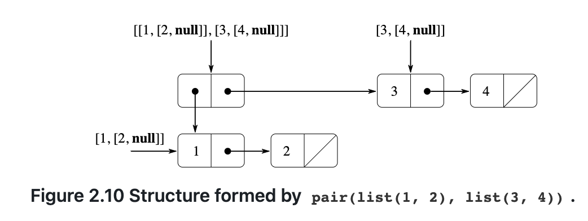
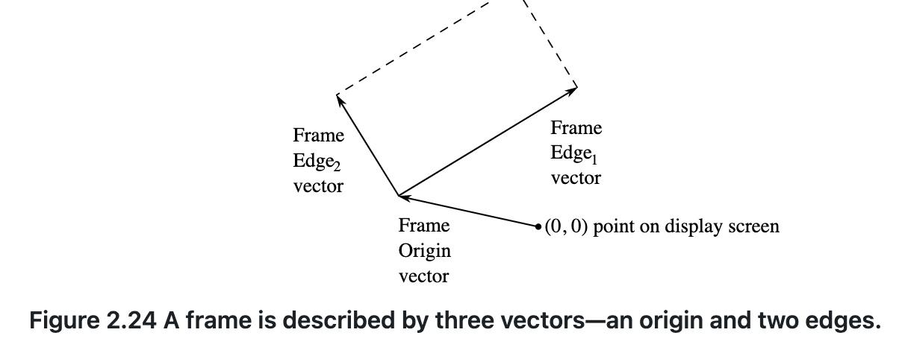

# Building Abstractions with Functions

## The Elements of Programming

* primitive expressions
* mean of combination
* means of abstraction

Function and Data

> Data is "stuff" that we want to manipulate, and Functions are descriptions of the rules
>
> for manipulating the data.

### Expressions

```js
486;

137 + 349; // 486

1000 - 334; // 666

5 * 99; // 495

10 / 4; // 2.5

2.7 + 10; // 12.7

```

Expressions such as these, which contain other expressions as components, are called combinations.

```js
(3 * 5) + (10 - 6); // 19

3 * 5 + 10 / 2;
// stands for 
(3 * 5) + (10 / 2);

1 - 5 / 2 * 4 + 3;
// stands for 
(1 - ((5 / 2) * 4)) + 3;

3 * 2 * (3 - 5 + 4) + 27 / 6 * 10;

3 * 2 * (3 - 5 + 4)
+
27 / 6 * 10;

```

Reads a statement typed by the user, evaluates the statement, and prints the result.

### Naming and the Environment

A critical aspect of a programming language is the means it provides for using names to refer to computational objects, and our first such means are constants.

```js
const size = 2;
```

caused the intercepter to associate the value 2 with name *size*.Once the name *size* has been associated with the number2, we can refer to the value 2 by name

```js
size;

// 2

5 * size;

// 10
```

The interpreter needs to execute the constant declaration for *size* before the name *size* can be used in an expression.

```js
const size = 2;
5 * size;

const pi = 3.14159;
const radius = 10;
pi * radius * radius;
// 314.159

const circumference = 2 * pi * radius;

circumference;
// 62.8318
```

Constant declartion is our language's simplest means of abstraction, for it allows us to use simple names to refer to the result of compound operations, such as the *circumference* computed above. In general, computational objects may have very complex structures, and it would be extremely inconvenient to have to remember and repeat their details each time we want to use them. Indeed, complex programs are constructed by building, step by step, computational objects of increasing complexity.

It should be clear that the possibility of associating values with names and later retrieving them means that the interpreter must maintain some sort of memory that keeps track of the name-object pairs.This memory is called the environment.

### Evaluating Operator Combinations

To evaluate an operator combination, do the following:

1. Evaluate the operand expressions of the combination
2. Apply the function that is denoted by the operator to the arguments that are the values of the operands

First, observe that the first step dictates that in order to accomplish the evaluation process for a combination we must first perform the evaluation process on each operand of the combination .Thus, the evaluation rule is *recursive* in nature; that is , it includes, as one of its steps, the need to invoke the rule itself.

Notice how succinctly the idea of recursion can be used to express what, in the case of a deeply nested combination ,would otherwise be viewed as a rather complicated process.

```js
(2 + 4 * 6) * (3 + 12)
```

We can obtain a picture of this precess by representing the combination in the form of a tree.

Each combination is represented by a node with branches corresponding to the operator and the operands of the combination stemming from it.The terminal nodes (that is, nodes with no branches stemming from them) represent either operators or numbers.Viewing evaluation in terms of the tree, we can imagine that the values of the operands percolate upward, starting from the terminal nodes and then combining at higher and higher levels.


Observe that the repeated application of the first step brings us to the point where we need to evaluate, not combination , but primitive expressions such as numerals or names. We take care of the primitive cases by stipulating that

* the values of numerals are the numbers that they name, and
* the values of names are the objects associated with those names in the environment

The key point to notice is the role of the environment in determining the meaning of the names in expressions. In an interactive language such as JavaScript, it is meaningless to speak of the value of an expression such as x + 1 without specifying any information about the environment that would provide a meaning for the name x. The general notion of the environment as providing a context in which evaluation takes place will play an important role in our understanding of program execution.

The purpose of the declaration (const x = 3) is precisely to associate x with a value.(That is, const x = 3; is not a combination.)

The word const is a keyword in JS. Keywords carry a particular meaning, and thus cannot be used as names.

A keyword or a combination of keywords in a statement instructs the JavaScript interpreter to treat the statement in a special way.

Each such syntactic from has its own evaluation rule. The various kinds of statements and expressions (each with its associated evaluation rule) constitute the syntax of the programming language.

### Compound Functions

We have identified in JavaScript some of the elements that must appear in any powerful programming language:

* Numbers and arithmetic operations are primitive data and functions
* Nesting of combinations provides a means of combining operations
* Constant declarations that associate means with values provide a limited means of abstraction

Now we will learn about function declarations, a much powerful abstraction technique by which a compound operation can be given a name and then referred to as a unit.

We begin by examining how to express the idea of "squaring". We might say, "To square something, take it times itself."This is expressed in our language as

```js
function square(x) {
  return x * x;
}
```

```txt
function square(    x   ) { return x    *     x; }
//  ^       ^       ^         ^    ^    ^     ^
// To    square something,  take   it times itself.
```

The simplest form of a function declaration is

```txt
function name(parameters) { return expression; }
```

Having declared *square*, we can now use it in a function application expression

```js
square(21);
// 441
```

Function applications are-after operator combinations-the second kind of combination of expression into large expressions.The general form of a function application is

```text
function-expression( argument-expressions )
```

Where the function-expression of the application specifies the function to be applied to the comma-separated argument-expressions.

* To evaluate a function application, do the following:

  1. Exaluate the subexpressions of the application, namely the function expression and the argument expressions
  2. Apply the function that is the value of the function expression to the values of the argument expression.

  ```js
  square(2 + 5);
  // 49
  ```

  Of course function application expressions can also serve as argument expressions.

  ```text
  square(x) + square(y)
  ```

  Declare a function *sum_of_squares* that, given any two numbers as arguments,produces the sum of their squares:

  ```js
  function sum_of_squares(x, y) {
    return square(x) + square(y);
  }

  sum_of_square(3,4);
  ```

  Now we can use sum_of_squares as a building block in constructinf future functions:

  ```js
  function f(a) {
    return sum_of_squares(a + 1, a * 2);
  }
  f(5);
  ```

  In addition to compound functions, any JS environment provides primitive functions that are build into the interpreter or loaded from libraries. Indeed, one could not tell by looking at the definition of *sum_of_squares* given above whether *square* was build into the interpreter, loaded from a library, or defined as a compound function.

### The Substitution Model for Function Application

To evaluate a function application, the interpreter evaluates the elements of the application and applies the function (which is the value of the function expression of the application) to the arguments (which are the values of the argument expressions of the application).

We can assume that the application of primitive functions is handed by the interpreter or libraries. For compound functions, the application process is as follows:

* To apply a compound function to arguments, evaluate the return expression of the function with each parameter replaced by the corresponding argument

Let's evaluate the application

```js
f(5)
```

We begin by retrieving the return expression of f:

```text
sum_of_squares(a + 1, a * 2)
```

Then we replace the parameter a by the argument 5:

```text
sum_of_squares(5 + 1, 5 * 2)
```

Thus the problem reduces to the evaluation of an application with two arguments and a functionc expression *sum_of_squares*.Evaluating this application involves three subproblems. We must evaluate the function expression to get the function to be applied, and we must evaluate the argument expressions to get the arguments. Now *5 + 1* produces 6 and *5* * *2* produces 10, so we must apply the *sum_of_squares* function to 6 and 10. These values are substituted for the parameters x and y in the body of *sum_of_squares*,reducing the expression to

```text
square(6) + square(10)
```

If we used the declaration of *square*, this reduces to

```text
(6 * 6) + (10 * 10)
```

which reduces by multiplication to

```text
36 + 100
```

and finally to

```text
136
```

The process we have just described is called the *substitution model* for function application. It can be taken as a model that determinis the "meaning" of function application, in so far.

Two points that should be stressed:

* The purpose of the substitution is to help us think about function application, not to provide a description of how the interpreter really works. Typical interpreters do not evaluate function applications by manipulating the text of a function to substitute values for the parameters.In practice, the "substitution" is accompanied by using a local environment for the parameters.
* We will present a sequence of increasingly elaborate models of how interpreter work. The substitution model is only the first of these models-a way to get started thinking formally about the evaluation process.In general, when                 modeling phenomena in science and engineering, we begin with simplified, incomplete models. As we examine things in greater detail, these simple models become inadequate and must be replaced by more refined models.

#### Applicative order versus normal order

According to the description of evaluation, the interpreter first evaluates the function and argument expressions and then applies the resulting function to the resulting arguments. An alternative evaluation model would not evaluate the arguments until their values were needed.Instead it would first substitute argument expressions for parameters until it obtained an expression involving only operators and primitive functions, and would then perform the evaluation .

```js
f(5)

sum_of_squares(5 + 1, 5 * 2)
square(5 + 1)				+ square(5 * 2)
(5 + 1) * (5 + 1) + (5 * 2) * (5 * 2)
6 * 6 + 10 * 10
 36       100
     136
```

This gives the same answer as out previous evaluation model, but the process is different.In particular, the evaluations of *5 + 1* and *5* * *2* are each performed twice here.

This alternative "fully expand and then reduce" evaluation method is known as *normal-order evaluation, in contrast to the "evaluate the arguments and then apply" method that the interpreter actually uses, which is called *applicative-order evaluation*. It can be shown that, for function applications that can be modeled using substitution and that yield legitimate values, normal-order and applicative-order evaluation produce the same value.

JS uses applicative-order evaluation,partly because of the additional efficiency obtained from avoiding multiple evaluations of expressions such as those illustrated with 5 + 1 and 5 * 2 above and , more significantly, because normal-order evlaluation becomes much more complicated to deal with when we leave the realm of functions that can be modeled by substitution.

### Conditional Expressions and Predicates

Case analysis can be written in JS usiing a conditional expression as

```js
function abs(x) {
  return x >= 0 ? x : - x;
}
```

which could be expressed as "If x is great than or equal to zero, return x; otherwise return -x"

The general form of a conditional expression is

```text
predicate ? consequent-expression : alternative-expression
```

Conditional expressions begin with a predicate-that is, an expression whose value is either true or false

To evaluate a conditional expression, the interpreter starts by evaluating the predicate of the expression.If the predicate evaluates to true, the interpreter evalautes the *consequent-expression* and return its value as the value of the conditional.If the predicate evaluates to false, it evaluates the *alternative-expression* and returns its value as the value of the conditional.

The word *predicate* is used for operators and functions that return true or false, as well as for expressions that evaluate to true or false.

If we prefer to handle the zero case separately, in js, we can express

```js
function abs(x) {
  return x > 0
  			? x
  			: x === 0
  			? 0
  			: -x;
}
```

In addition to primitive predicates such as >=, >, <, <=, ===, and !== that are applied to numbers, there are logical composition operations ,which enable us to construct compound predicates. The three most frequently used are these:

* *expression1 && expression2*

  This operation expresses *logic conjunction*, meaning roughly the same as the English word "and". This syntactic form is syntactic sugar for *expression1 ? expression2 : false*
* *expression1 || expression2*

  This operation expresses *logic disjunction*, meaning roughly the same as the English word "or". This syntactic form is syntactic sugar for *expression1 ? true : expression2 *
* *! expression*

  This operation expresses *logic negation*, meaning roughly the same as the English word "not".The value of the expression is true when *expression* evalautes to false, and false when *expression* evaluates to true.

As an example of how these predicates are used, the condition that a number *x* can be in range *5<x<10* may be expressed as

```text
x > 5 && x < 10
```

The syntactic form *&&* has low precedence than the comparison operators > and <

As another example, we can declare a predicate to test whether one number is greater than or equal to another as

```js
function greater_or_equal(x, y) {
  return x > y || x === y
}
```

or alternatively as

```js
function greater_or_equal(x, y) {
  return !(x < y)
}
```

The function *greater_or_equal*, when applied to two numbers, behaves the same as the operator >=. Unary operators have higher precedence than binary operators, which makes the parentheses in this example necessary.

#### Exercise 1.1

#### Exercise 1.2

#### Exercise 1.3

#### Exercise 1.4

#### Exercise 1.5

### Example: Square Roots by Newtom's Method

Functions, as introduced above, are much like ordinary mathematical functions. They specify a value that is determined by one or more parameters.But there is an important difference between mathematical functions and computer functions.Computer functions must be effective.

As a case in point, consider the problem of computing square roots. We can define the square-root function as


This describes a perfectly legitimate mathematical function. But, the definition does not describe a computer function.Indeed, it tells us almost nothing about how to actually find the square root of a given number.It will not help matters to rephrase this defintion in pseudo-JS

```js
function sqrt(x) {
  return the y with y >= 0 && square(y) === x;
}
```

The contrast between mathematical function and computer function is a reflection of the general distinction between describing properties of things and describing how to do things, or, as it is sometimes referred to, the distinction between declarative knowledge and imperative knowledge . In mathematics we are usually concerned with declarative (what is) description, whereas in computer science we are usually concerned with imperative (how to) descriptions.

How does one compute square roots? The most common way is to use Newton's method of successive approximations, which says that whenever we have a guess *y* for the value of the square root of a number *x*, we can perform a simple manipulation to get a better guess (one closer to the actual square root) by averaging *y* with *x/y*.

For example, we can compute the square root of 2 as follows. Suppose our initial guess is 1:

| Guess |     Quotient     |          Average          |
| :----: | :---------------: | :------------------------: |
|   1   |      2/1 = 2      |       (2+1)/2 = 1.5       |
|  1.5  |  2/1.5 = 1.3333  |  (1.3333+1.5)/2 = 1.4167  |
| 1.4167 | 2/1.4167 = 1.4118 | (1.4167+1.4118)/2 = 1.4142 |

Now let's formalize the process in terms of functions. We start with a value for the radicand(the number whose square root we are trying to compute) and a value for the guess.If the guess is good enough for our purposes, we are done; if not, we must repeat the process with an improved guess.

```js
function sqrt_iter(guess, x) {
  return is_good_enough(guess, x)
  			? guess
  			: sqrt_iter(improve(guess, x), x);
}
```

A guess is improved by averaging it with the quotient fo the radicand and the old guess:

```js
function improve(guess, x) {
  return average(guess, x / guess)
}
```

where

```js
function average(x, y) {
  return (x + y) / 2;
}
```

We also have to say that we mean by "good enough." The idea is to improve the answer until it is close enough so that its square differs from the radicand by less than a predetermined tolerance (here 0.001)

```js
function is_good_enoufh(guess, x) {
  return abs(square(guess) - x) < 0.001;
}
```

Finally, we need a way to get started. For instance, we can always guess that the square root of any number is 1:

```js
function sqrt(x) {
  return sqrt_iter(1, x)
}
```

The function *sqrt_iter*, demonstrates how iteration can be accomplished using no special construct other than the ordinary ability to call a function.

#### Exercise 1.6

#### Exercise 1.7

#### Exercise 1.8

### Functions as Black-Box Abstractions

The function *sqrt* is our first example of a process defined by a set of mutually defined functions.Notice that the declaration of *sqer_iter* is *recursive*; that is, the function is defined in terms of itself .The idea of being able to define a function in terms of itself may be disturbing ; it may seen unclear how such a "circular" definition could make sense at all, much less specify a well-defined process to be carried out by a computer. Let's consider some other important points illustrated by the *sqrt* example.

Observe that the problem of computing square roots breaks up naturally into a number of subproblems: how to tell whether a guess is good enough, how to improve a guess, and so on. Each of these tasks is accomplished by a separate function. The entire *sqrt* program can be viewed as a cluster of functions that mirrors the decomposition of the problem into subproblems.


The improtance of this decomposition strategy is not simply that one is dividing the program into parts. After all ,we could take any largt program and divide it into parts--the first ten lines, the next ten lines, the next ten line, and so on. Rather, it is crucial that each function  accomplished an identifiable task that can be used as a module in defining other functinos. For example, when we define the *is_good_enough* function in terms of *square*, we are able to regard the *square* function as a "black box." We are not at that moment conncerned with *how* the function computes its result, only with the fact that it compute the square. The detail of how to square is computed can be suppressed, to be considered at a later time. Indeed, as far as the *is_good_enough* function is concerned, *square* is not quite a function but rather than an abstraction of a function, a so-called *functional abstraction*.At this level of abstraction, any function that computes the square is equally good.

Thus, considering only the values they return, the following two functions squaring a number should be indistinguishable . Each takes a numerical argument and produces the square of that number as the value.

```js
function square(x) {
  return x * x;
}
```

```js
function square(x) {
  return math_exp(double(math_log(x)))
}
function double(x) {
  return x + x;
}
```

So a function should be able to suppress detail.

#### Local names

One detail of a function's implementation that should not matter to the user of the function is the implementer's choice of names for the function's parameters. Thus, the following functions should not be distinguishable:

```js
function square(x) {
  return x * x;
}

function square(y) {
  return y * y;
}
```

The principle-that the meaning of a function should be independent of the parameter names used by its author. The simplest consequence is that the parameter names of a function must be local to the body of the function.

For example, we used *square* in the declaration of *is_good_enough* in out square-root function:

```js
function is_good_enough(guess, x) {
  return abs(square(guess) - x) < 0.001;
}
```

The intention of the author of *is_good_enough* is to determine if the square of the first argument is within a given tolerance of the second argument.We see that the author of *is_good_enough* used the name *guess* to refer to the first argument and x to reder to the second argument. The argument of *square* is *guess*. If the author of *square* used x (as above) to refer to that argument, we see that the x in *is_good_enough* must be a different x than the one in *square*. Running the function *square* must not affect the value of x that is used by *is_good_enough*, because that value of x may be needed by *is_good_enough* after *square* is done computing.

If the parameters were not local to the bodies of their respective functions, then the parameter x in *square* could be confused with the parameter x in *is_good_enough*, and the behavior of *is_good_enough* would depend upon with version of *square* we used. Thus, *square* would not be the black box we desired.

A parameter of a functino has a very special role in the function declaration , in that it doesn't matter what name the parameter has. Such a name is called bound, and we say that the function declaration *binds* its parameters. The meaning of a function declaration is unchanged if a bound name is consistently renamed throughout the declaration. It a name is not bound, we say that it is *free*.The set of statements for which a binding declares a name is called the *scope* of that name. In a function declaration, the bound names declared as the parameters of the function have the body of the function as their scope.

In the declaration of *is_good_enough* above, *guess* and *x* are bound names but *abs* and *square* are free. The meaning of *is_good_enough* should be independent of the names we choose for *guess* and *x* so long as they are distinct and different from *abs* and *square*.(If we renamed *guess* and *abs* we would have introduced a bud by *capturing* the name *abs*. It would have changed from free to bound.) The meaning of *is_good_enough* is not indepent of the choice of its free names,however. It surely depends upon the face(external to this declaration) that the name *abs* refers to a function for computing the absolute value of a number. The function *is_good_enough* will compute a different function if we substitute *math_cos* (the primitive cosine function) for *abs* in its declaration .

#### Internal declarations and block structure

We have one kind of name isolation available to us so far: The parameters of a function are local to the body of the function.The square-root program illustrates another way in which we would like to control the use of names.

```js
function sqrt(x) {
  return sqrt_iter(1,x);
}
function sqrt_iter(guess, x) {
  return is_good_enough(guess,x)
  			 ? guess
  			 : sqrt_iter(improve(guess, x), x);
}
function is_good_enough(guess, x) {
  return abs(square(guess) - x ) < 0.001;
}
function improve(guess, x) {
    return average(guess, x / guess);
} 
```

The problem with this program is that the only function that is important to users of *sqrt* is *sqrt*. The other functions(sqrt_iter, is_good_enough, and improve) only clutter up their minds.

We would like to localize the subfunctions, hiding them inside *sqrt* so that *sqrt* could coexit with other successive approximations, each having its own private *is_good_enough* function. To make this possible, we allow a function to have internal declarations that are local to that function.

```js
function sqrt(x) {
    function is_good_enough(guess, x) {
        return abs(square(guess) - x) < 0.001;
    }
    function improve(guess, x) {
        return average(guess, x / guess);
    }
    function sqrt_iter(guess, x) {
        return is_good_enough(guess, x) 
               ? guess
               : sqrt_iter(improve(guess, x), x);
    }
    return sqrt_iter(1, x);
} 
```

Any matching pair of braces designates a *block*, and declarations inside the block are local to the block. Such nesting of declarations, called *block structure*, is basically the right solution to the simplest name-packaging problem.

In addition to internalizing the declarations of the auxiliary functions, we can simplify them.

```JS
function sqrt(x) {
    function is_good_enough(guess) {
        return abs(square(guess) - x) < 0.001;
    }
    function improve(guess) {
        return average(guess, x / guess);
    }
    function sqrt_iter(guess) {
        return is_good_enough(guess)
               ? guess
               : sqrt_iter(improve(guess));
    }
    return sqrt_iter(1);
} 
```

We will use block structure extensively to help us break up large programs into tractable pieces.

It appears in most advanced programming languages and is an important tool for helping to organize the construction of large programs.

## Functions and the Processes They Generate

We have now considered the elements of programming: We have used primitive arithmetic operations, we have combined these operations, and we have abstracted these composite operations by declaring them as compound functions. But that is not enough to enable us to say that we know how to program. Our situation is analogous to that of someone who has learned the rules for how the pieces move in chess but knows nothing of typical openings, tactics, or strategy. Like the novice chess player, we don't yet know the common patterns of usage in the domain. We lack the knowledge of which moves are worth making (which functions are worth declaring). We lack the experience to predict the consequences of making a move (executing a function).

The ability to visualize the consequences of the actions under consideration is crucial to becoming an expert programmer.To become experts, we must learn to visualize the processes generated by various types of functions. Only after we have developed such a skill can we learn to reliably construct programs that exhibit the desired behavior

A function is a pattern for the *local evolution* of a computational process. It specifies how each stage of the process is built upon the previous stage. We would like to be able to make statements about the overall, or *global*, behavior of a process whose local evolution has been specified by a function. This is very difficult to do in general, but we can at least try to describe some typical patterns of process evolution.

In this section we will examine some common "shapes" for processes generated by simple functions. We will also investigate the rates at which these processes consume the important computational resources of time and space.

### Linear Recursion and Iteration

We begin by considering the factorial function, defined by

```txt
n! = n * (n-1) * (n-2) ... 3 * 2 * 1 
```

There are many ways to compute factorials. One way is to make use of the observation that *n!* Is equal to *n* times(n-1)! for any positive integer *n*:

```txt
n! = n*[(n-1) * (n-2) ... 3 * 2 * 1] = n * (n-1)!
```

Thus, we can compute *n!* by computing (n-1)! and multiplying the result by *n*. If we add the stipulation that 1! is equal to 1, this observation translates directly into a computer function:

```js
function factorial(n) {
  return n === 1 
  			? 1
  			: n * factorial(n-1);
}
```


Now let's take a different perspective on computing factorials. We could describe a rule for computing *n*! by specifying that we first multiply 1 by 2, then multiply the result by 3, then by 4, and so on until we reach *n*. More formally, we maintain a running product, together with a counter that counts from 1 up to *n*.e can describe the computation by saying that the counter and the product simultaneously change from one step to the next according to the rule

```txt
product  <-  counter * produce
counter  <-  counter + 1
```

and stipulating that *n*! is the value of the product when the counter exceeds *n*.

```js
function factorial(n) {
  return fact_iter(1, 1, n);
}

fcuction fact_iter(product, counter, max_count) {
  return counter > max_count 
  			? product
  			: fact_iter(counter * product,
                   counter + 1,
                   max_count);
}
```

As before, we can use the substitution model to visualize the process


Compare the two processes. From one point of view, they seem hardly different at all. Both compute the same mathematical function on the same domain, and each requires a number of steps proportional to *n* to compute *n*!. Indeed, both processes even carry out the same sequence of multiplications, obtaining the same sequence of partial products. On the other hand, when we consider the "shapes" of the two processes, we find that they evolve quite differently.

Consider the first process.The expansion occurs as the process builds up a chain of *deferred operations* (in this case, a chain of multiplications). The contraction occurs as the operations are actually performed. This type of process, characterized by a chain of deferred operations, is called a *recursive process*.Carrying out this process requires that the interpreter keep track of the operations to be performed later on.  In the computation of *n*!, the length of the chain of deferred multiplications, and hence the amount of information needed to keep track of it, grows linearly with *n* (is proportional to *n*), just like the number of steps. Such a process is called a *linear recursive process*.

By contrast, the second process does not grow and shrink. At each step, all we need to keep track of, for any *n*, are the current values of the names `product`, `counter`, and `max_count`. We call this an *iterative process*. In general, an iterative process is one whose state can be summarized by a fixed number of *state variables*, together with a fixed rule that describes how the state variables should be updated as the process moves from state to state and an (optional) end test that specifies conditions under which the process should terminate.In computing *n*!, the number of steps required grows linearly with *n*. Such a process is called a *linear iterative process*.

The contrast between the two processes can be seen in another way. In the iterative case, the state variables provide a complete description of the state of the process at any point. If we stopped the computation between steps, all we would need to do to resume the computation is to supply the interpreter with the values of the three state variables. Not so with the recursive process. In this case there is some additional "hidden" information, maintained by the interpreter and not contained in the state variables, which indicates "where the process is" in negotiating the chain of deferred operations. The longer the chain, the more information must be maintained.

In contrasting iteration and recursion, we must be careful not to confuse the notion of a recursive *process* with the notion of a recursive *function*. When we describe a function as recursive, we are referring to the syntactic fact that the function declaration refers (either directly or indirectly) to the function itself. But when we describe a process as following a pattern that is, say, linearly recursive, we are speaking about how the process evolves, not about the syntax of how a function is written. It may seem disturbing that we refer to a recursive function such as `fact_iter` as generating an iterative process. However, the process really is iterative: Its state is captured completely by its three state variables, and an interpreter need keep track of only three names in order to execute the process.

### Tree Recursion

Another common pattern of computation is called *tree recursion*. As an example, consider computing the sequence of Fibonacci numbers,  in which each number is the sum of the preceding two:

```txt
0, 1, 1, 2, 3, 5, 8, 13, 21,...
```

In general, the Fibonacci numbers can be defined by the rule

```txt
            0                       if n = 0
Fib(n) =    1                       if n = 1
            Fib(n-1) + Fib(n-2)     otherwise
```

We can immediately translate this definition into a recursive function for computing Fibonacci numbers:

```js
function fib(n) {
  return n === 0 
  			? 0
  			: n === 1
  			? 1
  			: fib(n-1) + fib(n-2);
}
```


Consider the pattern of this computation. To compute fib(5), we compute fib(4) and fib(3). To compute fib(4), we compute fib(3) and fib(2).In general, the evolved process looks like a tree.Notice that the branches split into two at each level (except at the bottom); this reflects the fact that the fib function calls itself twice each time it is invoked.

This function is instructive as a prototypical tree recursion, but it is a terrible way to compute Fibonacci numbers because it does so much redundant computation.

Thus, the process uses a number of steps that grows exponentially with the input. On the other hand, the space required grows only linearly with the input, because we need keep track only of which nodes are above us in the tree at any point int the computation. In general, the number of steps required by a tree-recursive process will be proportional to the number of nodes in the tree, while the space required will be proportional to the maximum depth of the tree.

We can also formulate an iterative process for computing the Fibonacci numbers. The idea is to use a pair of integers a and b, initialized to Fib(1) = 1 and Fib(0) = 0, and to repeatedly apply the simultaneous transformations

```txt
a <- a + b
b <- a
```

It is not hard to show that, after applying this transformation n times, a and b will be equal, respectively, to Fib(n+1) and Fib(n). Thus, we can compute Fibonacci numbers iteratively using the function

```js
function fib(n) {
  return fib_iter(1, 0, n)
}

function fib_iter(a, b, count) {
  return count === 0 
  			? b 
  			: fib_iter(a + b, a, count - 1);
}
```

The second muthod for computing Fib(n) is a liner iteration. The difference in number of steps required by the two methods - one liner in n, one growing as fast as Fib(n) itself-is enormous, even for small inputs.

One should not conclude from this that tree-recursive processes are useless. When we consider processes that operate on hierarchically structured data rather than numbers, we wii find that tree recursion is a natural and powerful tool. But even in numerical operations, tree-recursive processes can be useful in helping us to understand and design programs. For instance, although the first *fib* function is much less efficient than the second one, it is more straightforward , being little more than a translation into JS of the definition of the Fibonacci sequence. To formulate the iterative algorithm required noticing that the computation could be recast as an iteration with three state variables .

### Example: Counting change

It takes only a bit of cleverness to come up with the iterative Fibonacci algorithm. In contrast, consider the following problem: How many different ways can we make change of $1.00(100 cents), given half-dollars, quarters, dimes, nickels, and pennies(50 cents, 25cents, 10cents, 5 cents, and 1 cent, respectively)? More generally, can we write a function to compute the number of ways to change any given amount of money?

This probelm has a simple solution as a recursive function. Suppose we think of the types of coins available as arranged in some order. Then the following relation holds:

> The nubmer of ways to change amount *a* using *n* kinds of coins equals
>
> * the number of ways to change amount *a* using all but the first kind of coin, plus
> * the number of ways to change amount *a* - *d* using all *n* kinds of coins, where *d* is the denomination of the first kind of coin.

To see why this is true, observe that the ways to make change can be divided into two groups: those that do not use any of the first kind of coin, and those that do. Therefore, the total number of ways to make change for some amount is equal to the number of ways to make change for the amount without using any of the first kind of coin, plus the number of ways to make change assuming that we do use the first kind of coin. But the latter number is equal to the number of ways to make change for the amount that remains after using a coin of the first kind.

Thus, we can recursively reduce the problem of changing a given amount to problems of changing smaller amounts or using fewer kinds of coins. Consider this reduction rule carefully, and convince yourself that we can use it to describe an algorithm if we specify the following degenerate cases:

* If *a* is exactly 0, we should count that as 1 way to make change
* If *a* is less than 0, we should count that as 0 ways to make change
* If *n* is 0, we should count that as 0 ways to make change

We can easily translate this description into a recursive function:

```js
function count_change(amount) {
  return cc(amount, 5)
}

function cc(amount, kinds_of_coins) {
  return amount === 0 
  			? 1
  			: amount < 0 || kinds_of_coins === 0
  			? 0
  			: cc(amount, kinds_of_coins - 1)
  				+ 
    			cc(amount - first_denomination(kinds_of_coins),
            kinds_of_coins);
}

function first_denamination(kinds_of_coins) {
      return kinds_of_coins === 1 ? 1
         : kinds_of_coins === 2 ? 5
         : kinds_of_coins === 3 ? 10
         : kinds_of_coins === 4 ? 25
         : kinds_of_coins === 5 ? 50
         : 0;  
}
```

(The first_denomination function takes as input the number of kinds of coins available and returns the denomination of the first kind. Here we are thinking of the coins as arranged in order from largest to smallest, but any order would do as well.)

We can now answer our original question about changing a dollar:

```js
count_change(100);
```

The function *count_change* generates a tree-recursive process with redundancies similar to those in our first implementation of *fib*.

### Orders of Growth

The previous examples illustrate that processes can differ considerably in the rates at which they consume computational resources.  One convenient way to describe this difference is to use the notion of *order of growth* to obtain a gross measure of the resources required by a process as the inputs become larger.

For instance, with the linear recursive process for computing factorial described in section 1.2.1 the number of steps grows proportionally to the input *n*.  Thus, the steps required for this process grows as Θ(n).  We also saw that the space required grows as Θ(n). For the iterative factorial, the number of steps is still Θ(n) but the space is Θ(1)—that is, constant.The tree-recursive Fibonacci computation requires Θ(ϕ^n) steps and space Θ(n), where ϕ is the golden ratio described in section 1.2.2.

### Exponentiation

Consider the problem of computing the exponential of a given number. We would like a function that takes as arguments a base *b* and a positive integer exponent *n* and computes b^n. One way to do this is via recursive definition

```txt
b^n = b * b^n-1
b^0 = 1
```

which translates readily into the function

```js
function expt(b, n) {
  return n === 0 
  			? 1
  			: b * expt(b, n - 1);
}
```

This is a linear recursive process, which requires Θ(n) steps and Θ(n) space.

```js
function expt(b, n) {
  return expt_iter(b, n, 1);
}

function expt_iter(b, counter, product) {
  return counter === 0 
  			? product
  			: expt_iter(b, counter - 1, b * product);
}
```

This version requires Θ(n) steps and  Θ(1) space.

We can compute exponentials in fewer steps by using successive squaring. For instance, rather than computing b^8 as

```txt
b * (b *(b *(b *(b *(b *(b * b))))))
```

  We can compute it using three multiplications:

```txt
b^2 = b * b
b^4 = b^2 * b^2
b^8 = b^4 * b^4
```

This method works fine for exponents that are powers of 2.  We can also take  advantage of successive squaring in computing exponentials in general if we  use the rule

```txt
b^n = (b^n/2)^2				if n is even
b^n = b * b^(n-1)			if n is odd
```

We can express this method as a function:

```js
function fast_expt(b, n) {
  return n === 0 
  			? 1
  			: is_even(n)
  			? square(fast_expt(b, n/2))
  			: b * fast_expt(b, n - 1);
}
function is_even(n) {
  return n % 2 === 0;
}
```

The process evolved by *fast_expt* grows logarithmically with *n* in both space and number of steps.

### Greatest Common Divisors

The greatest common divisor (GCD) of two integers *a* and *b* is defined to be the largest integer that divides both *a* and *b* with no remainder.For example, the GCD og 16 and 28 is 4. One way to find the GCD of two integers is to factor them and search for common factors, but there is a famous algorithm that is much more efficient.

The idea of the algorithm is based on the observation that, if *r* is the remainder when *a* is divided by *b*, then the common divisors of *a* and *b* are precisely the same as the common divisors of *b* and *r*.Thus, we can use the equation

```txt
GCD(a,b) = GCD(b,r)
```

to successively reduce the problem of computing a GCD to the problem of computing the GCD of smaller and smaller pairs of integers. For example,

```txt
GCD(206, 40) = GCD(40, 6)
						 = GCD(6, 4)
						 = GCD(4, 2)
						 = GCD(2, 0)
						 = 2
```

reduces GCD(206, 40) to GCD(2, 0), which is 2. It is possible to show that starting with any two positive integers and performing repeated reductions will always eventually produce a pair where the second number is 0. Then the GCD is the other number in the pair. This method for computing the GCD is know as *Euclid*'s Algorithm.

It is easy to express Euclid's Algorithm as a function:

```js
function gcd(a, b) {
  return b === 0 ? a : gcd(b, a % b);
}
```

This generates an iterative process, whose number of steps grows as the logarithm of the numbers involved.

> **Lame's Theorem** :If Euclid's Algorithm requires *k* steps to compute the GCD of some pair, then the smaller number in the pair must be greater than or equal to the *k*th Fibonacci number.

### Example: Testing for Primality

The section describes two methods for checking the primality of an integer *n*

#### Searching for divisors

Since ancient times, mathematicians have been fascinated by problems concerning prime numbers, and many people have worked on the problem of determining ways to test if numbers are prime. The following program finds the samllest integral divisor (greater than 1) of a given number *n*. It does this in a straightforward way, by testing *n* for divisibility by successive integers starting with 2.

```js
function smallest_divisor(n) {
  return find_divisor(n, 2);
}
function find_divisor(n, test_divisor) {
  return square(test_divisor) > n
  			? n
  			: divides(test_divisor, n)
  			? test_divisor
  			: find_divisor(n, test_divisor + 1)
}

function divides(a, b) {
  return b % a === 0;
}
```

We can test whether a nubmer is prime as follows: *n* is prime if and only if *n* is its own smallest divisor.

```js
function is_prime(n) {
  return n === smallest_divisor(n);
}
```

## Formulating Abstractions with Higher-Order Functions

We have seen that functions are, in effect, abstractions that describe compound operations on numbers independent of the
particular numbers. For example, when we declare

```js
function cube(x) {
    return x * x * x;
}
```

we are not talking about the cube of a particular number, but rather about a method for obtaining the code of any number.
Of course get along without ever declaring this function, by always writing expressions such as

```text
3 * 3 * 3
x * x * x
y * y * y
```

are never mentioning *cube* explicitly. This would place us at a serious disadvantage, forcing us to work always at the
level of the particular operations that happen to be primitives in the language (multiplication, in this case) rather than
in terms of higher-level operations. Our programs would be able to compute cubes, but our language would lack the ability
to express the concept of cubing.One of the things we should demand from a powerful programming language is the ability to
build abstractions by assigning names to common patterns and then to work in terms of the abstractions directly.Functions
provide this ability. This is why all but the most primitive programming languages include mechanisms for declaring functions.

Yet even in numerical processing we will be severely limited in our ability to create abstractions if we are restricted to
functions whose parameters must be numbers. Often the same programming pattern will be used with a number of different functions.
To express such patterns as concepts, we will need to construct functions that can accept functions as arguments or return
functions as values.Functions that manipulate functions are called *higher-order* functions.

### Functions as Arguments

Consider the following three functions. The first computes the sum of the integers from *a* through *b*:

```js
function sum_integers(a, b) {
    return a > b
            ? 0
            : a + sum_integers(a + 1, b);
}
```

The second computes the sum of the cubes of the integers in the given range:

```js
function sum_cubes(a, b) {
    return a > b
           ? 0
           : cube(a) + sum_cubes(a + 1, b);
} 
```

The third computes the sum of a sequence of terms in the series

```js
function pi_sum(a, b) {
    return a > b
           ? 0
           : 1 / (a * (a + 2)) + pi_sum(a + 4, b);
}
```

These three functions clearly share a common underlying pattern. They are for the most part identical, differing only in
the name of the function, the function of *a* used to compute the term to be added, and the function that provides the
next value of *a*. We could generate each of the functions by filling in slots in the same template:

```text
function name(a, b) {
    return a > b
           ? 0
           : term(a) + name(next(a), b);
}
```

The presence of such a common pattern is strong evidence that there is a useful abstraction waiting to be brought to the surface.
As program designers, we would like our language to be powerful enough so that we can write a function that expresses the
concept of summation itself rather than only functions that compute particular sums. We can do so readily in our functional
language by taking the common template shown above and transforming the "slots" into parameters:

```text
function sum(term, a, next, b) {
    return a > b
           ? 0
           : term(a) + sum(term, next(a), next, b);
}
```

Notice that *sum* takes as its arguments the lower and upper bounds *a* and *b* together with the functions *tem* and *next*. We can use *sum* just as we would any function. For example, we can use it to define *sum_cubes*:

```js
function inc(n) {
  return n + 1;
}

function sum_cubes(a, b) {
  return sum(cube, a, inc, b);
}

sum_cubes(1, 10);
```

With the aid of an identity function to compute the term, we can define *sum_integers* in terms of *sum* :

```js
function identity(x) {
  return x;
}
function sum_integers(a, b) {
  return sum(identity, a, inc, b);
}
sum_integers(1, 10);
```

We can also define *pi_sum* in the same way

```js
function pi_sum(a, b) {
  function pi_term(x) {
    return 1 / (x * (x + 2));
  }
  function pi_next(x) {
    return x + 4;
  }
  return sum(pi_term, a, pi_next, b);
}
```

### Constructing Functions using Lambda Expressions

In using *sum* as before, it seems terribly awkward to have to declare trivial function such as *pi_term* and *pi_next* just so we can use them as argument to our higher-order function. Rather than declare *pi_next* and *pi_term*, it would be more convenient to have a way to directly specify "the function that returns its input incremented by 4" and "the function that returns the reciprocal of its input times its input plus 2." We can do this by introducing the *lambda expression* as a syntactic form for creating functions. Using lambda expressions, we can describe what we want as

```js
x => x + 4
```

and

```js
x => 1 / (x * (x + 2))
```

Then we can express our *pi_sum* function without declaring any auxiliary functions:

```js
function pi_sum(a, b) {
  return sum(x => 1 / (x * (x + 2)),
            a,
            x => x + 4,
            b);
}

function integral(f, a, b, dx) {
  return sum(f,
            a + dx / 2,
            x => x + dx,
            b)
  				*
    			dx;
}
```

In general, lambda expressions are used to create functions in the same way as function declarations,  except that no name is specified for the function and the `return` keyword and braces are omitted

```txt
(parameters) => expression
```

The resulting function is just as much a function as one that is created using a function declaration statement.  The only difference is that it has not been associated with any name in the environment.

We consider

```js
function plus4(x) {
  return x + 4;
}
```

to be equivalent to

```js
const plus4 = x => x + 4;
```

We can read a lambda expression as follows:

```txt
//                      x         =>                   x    +   4
//                      ^         ^                    ^    ^   ^
// the function of an argument x that results in the value plus 4
```

Like any expression that has a  function  as its value, a  lambda  expression can be used as the function expression in an application   such as

```js
((x,y,z) => x + y + square(x))(1, 2, 3);
```

or, more generally, in any context where we would normally use a  function  name.

#### Using *const* to create local names

 Another use of lambda expressions is in creating local names. We often need local names in out functions other than those that have been bound as parameters. For example, suppose we wish to compute the function

```txt
f(x,y) = x(1+xy)^2 + y(1−y) + (1+xy)(1−y)
```

  which we cound also express as

```txt
a = 1 + xy
b = 1 - y
f(x,y) = xa^2 + yb + ab
```

In writing a function to compute *f*, we would like to include as local names not only *x* and *y* but also the names of intermediate quantities like *a* and *b*. One way to accomplish this is to use an auxiliary function to bind the local names:

```js
function f(x, y) {
  function f_helper(a, b) {
    return x * square(a) + y * b + a * b;
  }
  return f_helper(1 + x * y, 1 - y);
}
```

Use a lambda expression to specify an anonymous function for binding out local names.

```js
function f_2(x, y) {
  return ( (a, b) => x * square(a) + y * b + a * b)(1 + x * y, 1 - y);
}
```

More convenient way to declare local names is by using constant declarations within the body of the function. Using *const*,

```js
function f_3(x, y) {
  const a = 1 + x * y;
  const b = 1 - y;
  return x * square(a) + y * b + a * b;
}
```

#### Conditional statements

When functions become big, we should keep the scope of the names as narrow as possible

```js
function expmod(base, exp, m) {
  return exp === 0 
  				? 1
  				: is_even(exp)
  				? ( expmod(base, exp / 2, m)
            * expmod(base, exp / 2, m)) % m
  				: (base * expmod(base, exp - 1, m)) % m;
}
```

This function is unnecessarily inefficient , because it contains two identical calls:

```js
expmod(base, exp / 2, m);
```

We would be tempted to introduce a local name for the expression

```js
function expmod(base, exp, m) {
  const half_exp = expmod(base, exp / 2, m);
  return exp === 0
  				? 1
  				: is_even(exp)
  				? (half_exp * half_exp) % m
  				: (base * expmod(base, exp - 1, m)) % m;
}
```

This would make the function nonterminating. The problem is that the constant declaration appears outside the conditional expression, which means that is is executed even when the base case exp === 0 is met. To avoid this situation, we provide for *conditional statements*, and allow return statements to appear in the branches of the statement.. Using a conditional statement, we can write the function *expmod* as follows:

```js
function expmod(base, exp, m) {
  if (exp === 0) {
    return 1;
  } esle {
    if (is_even(exp)) {
      const half_exp = expmod(base, exp / 2, m);
      return (half_exp * half_exp) % m;
    } esle {
      return (base * expmod(base, exp - 1, m)) % m;
    }
  }
}
```

The general form of a conditional statement is

```txt
if (predicate) { consequent-statements } else { alternative-statements}
```

As for a conditional expression, the interpreter first evaluates the *predicate*. If it evaluates to true, the interpreter evaluates the *consequent-statements* in sequence, and if it evaluates to false, the interpreter evalautes the *alternative-statements* in sequence. Evaluation of a return      statement returns from the surrounding function, ignoring any statements in the sequence            after the return statement and any statements after the conditional statement.  Note that any constant declarations occurring in either part are local to that  part, because each part is enclosed in braces and thus forms its own  block.

### Functions as General Methods

We introduced compound functions as a mechanism for abstracting patterns of numerical operations so as to make them independent of the particular numbers involved. With higher-order functions , such as the *integral* function, we began to see a more powerful kind of abstraction: functions used to express general methods of computation , independent of the particular functions involved.

#### Finding roots of equations by the half-interval method

The *half-interval* method is a simple but powerful technique for finding roots of an equation f(x) = 0, where f is a continuous function. The idea is that, if we are given points a and b such that f(a) < 0 < f(b), then f must have at least one zero between a and b. To locate a zero, let *x* be the average of a and b and compute f(x). If f(x) > 0, then f must have a zero between a and x. If f(x) < 0, then f must have a zero between x and b. Continuing in this way, we can identify smaller and smaller intervals on  which f must have a zero.  When we reach a  point where the interval is small enough, the process stops.

```js
function search(f, neg_point, pos_point) {
  const midpoint = average(neg_point, pos_point);
  if (close_enough(neg_point, pos_point)) {
    return midpoint;
  } else {
    const text_value = f(midpoint);
    return positive(test_value)
    				? search(f, neg_point, midpoint)
    				: negative(test_value)
    				? search(f, midpoint, pos_point)
    				: midpoint;
  }
}
```

We assume that we are initially given the function f together with points at which it's values are negative and positive.We first compute the midpoint of the two given points. Next we check to see if the given interval is small enough , and if so we simply return the midpoint as out answer. Otherwise, we compute as a test value the value of f at the midpoint. If the test value is positive, then we continue the process with a new interval running from the original negative point to the midpoint. If the test value  is negative, we continue with the interval from the midpoint to the positive  point. Finally, there is the possibility that the test value is 0, in    which case the midpoint is itself the root we are searching for.

```js
function close_enough(x, y) {
  return abs(x - y) < 0.001;
}
```

The function *search* is awkward to use directly, because we can accidentally give it points at which f's values do not have the required sign, in which case we get a wrong answer. Instead we will use *search* via the following function, which checks to see which of the endpoints has a negative function value and which has a positive value, and calls the *search* function accordingly. If the function has the same sign on the two given points, the half-interval method cannot be used, in which case the function signals an error.

```js
function half_interval_method(f, a, b) {
  const a_value = f(a);
  const b_value = f(b);
  return negative(a_value) && positive(b_value)
  				? search(f, a, b)
  				: negative(b_value) && positive(a_value)
  				? search(f, b, a)
  				: error("values are not of opposite sign");
}
```

```js
half_interval_method(math_sin, 2, 4);
```

#### Finding fixed points of functions

A number *x* is called a *fixed point* of a function *f* if x satisfies the
equation *f(x) = x*. For some functions *f* can locate a fixed point by beginning
with an initial guess and applying *f* repeatedly,

```text
f(x), f(f(x)), f(f(f(x))), …
```

until the value does not change very much. Using this idea, we can devise a
function *fixed_point* that takes as inputs a function and an initial guess and
produces an approximation to a fixed point of the function. We apply the function
repeatedly until we find two successive values whose difference is less than some
prescribed tolerance:

```js
const tolerance = 0.00001;
function fixed_point(f, first_guess) {
  function close_enough(x, y) {
    return abs(x - y) < tolerance;
  }

  function try_with(guess) {
    const next = f(guess);
    return close_enough(guess, next)
            ? next
            : try_with(next);
  }
  return try_with(first_guess);

}
fixed_point(math_cos, 1);
```

The fixed-point process is reminiscent of the process we used for finding
square roots. Both are based on the idea of repeatedly improving guess until the result
satisfied some criterion. In face, we can readily formulate the square-root
computation as a fixed-point search. Computing the square root of some number *x* reuqires
finding a *y* such that *y^2 = x*. Putting this equation into the equivalent
form *y = x/y*. we recognize that we are looking for a fixed point of the function
*y -> x/y*, and we can therefore try to compute square root as

```js
function sqrt(x) {
    return fixed_point(y=> x/y, 1);
}
```

Unfortunately, this fixed-point search does not converge. Consider an initial guess *y1*.
The next guess is *y2 = x/y1* and the next guess is *y3 = x/y2 = x/(x/y1) = y1*. This results in an
infinite loop in which the two guesses *y1* and y2* repeat over and over, oscillating about the answer.

One way to control such oscillations is to prevent the guesses from changing so much.
Since the answer is always between out guess *y* and *x/y*, we can make a new guess that is
not as far from *y* as *x/y* by averaging *y* with *x/y*, so that the next guess after *y* is *1/2(y+x/y)*
instead of *x/y*.The process of making such a sequence of guesses is simply the process of looking for a fixed
point of *y ->  1/2(y + x/y):

```js
function sqrt(x) {
    return fixed_point(y => average(y, x / y), 1);
}
```

With this modification, the square-root function works. In fact, if we unravel the definitions, we can see that the
sequence of approximations to the square root generated here is precisely the same as the one generated by our original square-root function

### Functions as Returned Values

The above examples demonstrate how the ability to pass functions as arguments significantly enhances the expressive power of out programming language. We can achieve even more expressive power by creating functions whose returned values are themselves functions.

At the fixed-point example, we used average damping to make the approximations converge. Namely, given a function *f*, we consider the function whose value at *x* is equal to the average of *x* and  *f(x)*

```js
function average_damp(f) {
  return x => average(x, f(x));
}
```

The function *average_damp* takes as its argument a function *f* and returns as its value a function(produced by the lambda expression) that, when applied to a number *x*,produces the average of *x* and *f(x)*.

```js
average_dump(square)(10);
```

Using *average_damp*, we can reformulate the square-root function as follows:

```js
function sqrt(x) {
  return fixed_point(average_damp(y => x / y), 1);
}
```

Notice how this formulation makes explicit the three ideas in the method: fixed-point search, average damping, and the function *y -> x/y*.It is instructive to compare this formulation of the square-root method with the original version. Bear in mind that these functions express the same process, and notice how much clearer the idea becomes when we express the process in terms of these abstractions.

As a simple example of reuse, notice that the cube root of *x* is a fixed point of the function *y -> x/y^2*, so we can immediately generalize our square-root function to one that extracts cube roots.

```js
function cube_root(x) {
  return fixed_point(average_damp(y => x / square(y)), 1);
}
```

#### Newton's method

Newton's method is the use of the fixed-point method we saw above to approximate a solution of the equation by finding a fixed point of the function *f*.

In order to implement Newtion's method as a function, we must first express the idea of derivative .Note that "derivative", like average damping, is something that transforms a function into another function. For instance, the derivate of the function *x* -> *x^3* is the function *x -> 3x^2*

In general, we can express the idea of derivative

```js
function deriv(g) {
  return x => (g(x + dx) - g(x)) / dx;
}
const dx = 0.00001;

function cube(x) {
  return x * x * x;
}
deriv(cube)(5);
```

we can express Newton's method as a fixed-point process

```js
function newton_transform(g) {
  return x => x - g(s) / deriv(g)(x);
}
function newtons_method(g, guess) {
  return fixed_poinr(newton_transform(g), guess);
}
```

It takes as arguments a function that computes the function for which we want to find zero, together with an initial fuess.

For instance, to find the square root of *x*, we can use Newton's method to find a zero of the function *y -> y^2 - x* starting with an initial guess of 1.

```js
function sqrt(x) {
  return newtons_method(y => square(y) - x, 1);
}
```

#### Abstractions and first-class functions

We've seen two ways to express the square-root computation as an instance of a more general method, once as a
fixed-point search and once using Newton's method. Since Newton's method was itself expressed as a fixed-point process,
we actually saw two ways to compute square roots as fixed points. Each method begins with a function and finds a fixed
point of some transformation of the function.

```js
function fixed_point_of_transform(g, transdform, guess) {
    return fixed_point(transdform(g), guess);
}
```

This very general function takes as its arguments a function *g* that computes some function, a function that
transforms *g*, and an initial guess. The returned result is a fixed point of the transformed function.

Using this abstraction, we can recast the first square-root computation from this section

```js
function sqrt(x) {
    return fixed_point_of_transform(
        y => x /y, 
            average_damp,
            1);
}
```

We began section with the observation that compound functions are a crucial abstraction mechanism, because they
permit us to express general methods of computing as explicit elements in our programming language. Now we've seen
how higher-order functions permit us to manipulate these general methods to create further abstractions.

As programmers, we should be alert to opportunities to identify the underlying abstractions in our programs and to build
upon them and generalize them to create more powerful abstractions. This is not to say that one should always write programs
in the most abstract way possible; expert programmers know how to choose the level of abstraction appropriate to their task.
But it is important to be able to think in terms of these abstractions, so that we can be ready to apply them in new contexts.
The significance of higher-order functions is that they enable us to represent these abstractions explicitly as elements in our
programming language, so that they can be handled just like other computational elements.

In general, programming languages impose restrictions on the ways in which computational elements can be manipulated.
Elements with the fewest restrictions are said to have first-class status. Some of the "rights and privileges" of first-class
elements are:

* They may be referred to using names.
* They may be passed as arguments to functions.
* They may be returned as the results of functions.
* They may be included in data structures.

JavaScript, like other high-level programming languages, awards functions full first-class status. This poses challenges
for efficient implementation, but the resulting gain in expressive power is enormous.

# Building Abstractions with Data

We concentrated om computational processes and on the role of functions in program design. We saw how to use primitive data (numbers) and primitive operations (arithmetic operations), how to combine functions to form compound functions through composition. conditionals, and the use of parameters, and how to abstract processes by using function declarations. We saw that a function can be regarded as a pattern for the local evolution of a process, and we classified, reasoned about, and performed simple algorithmic analyses of some common patterns for processes as enhance the power of out language by enabling us to manipulate, and thereby to reason in terms of, general methods of computation. This is much of the essence of programming.

In this chapter we are going to look at more complex data. All the function in chapter 1 operate on simple numerical data, and simple data are not sufficient for many of the problems we wish to address using computation. Programs are typically designed to model complex phenomena, and more often than not one must construct computational objects that have several parts in order to model real-world phenomena that have several aspects. Thus, whereas our focus in chapter 1 was on building abstractions by combining functions to form compound functions, we turn in this chapter to another key aspect of any programming language: the means it provides for building abstractions by combining data objects to form *compound data*.

Why do we want compound data in a programming language? For the same reasons that we want compound functions: to elevate the conceptual level at which we can design our programs, to increase the modularity of our designs, and to enhance the expressive power of our language. Just as the ability to declare functions enables us to deal with processes at a higher conceptual level than that of the primitive operations of the language, the ability to construct compound data objects enables us to deal with data at a higher conceptual level than that of the primitive data objects of the language.

Consider the task of designing a system to perform arithmetic with rational numbers. We could imagine an operation add_rat that takes two rational numbers and produces their sum. In terms of simple data, a rational number can be thought of as two integers: a numerator and a denominator.Thus, we could design a program in which each rational number would be represented by two integers (a numerator and a denominator) and where add_rat would be implemented by two functions (one producing the numerator of the sum and one producing the denominator). But this would be awkward, because we would then need to explicitly keep track of which numerators corresponded to which denominators. In a system intended to perform many operations on many rational numbers, such bookkeeping details would clutter the programs substantially, to say nothing of what they would do to our minds.  It would be much better if we could "glue together" a numerator and denominator to form a pair—a compound data object—that our programs could manipulate in a way that would be consistent with regarding a rational number as a single conceptual unit.

The use of compound data also enables us to increase the modularity of our programs. If we can manipulate rational numbers directly as objects in their own right, then we can separate the part of our program that deals with rational numbers per se from the details of how rational numbers may be represented as pairs of integers. The general technique of isolating the parts of a program that deal with how data objects are represented from the parts of a program that deal with how data objects are used is a powerful design methodology called data abstraction. We will see how data abstraction makes programs much easier to design, maintain, and modify.

The use of compound data leads to a real increase in the expressive power of our programming language.  Consider the idea of forming a "linear combination"ax+by. We might like to write a function that would accept aaa, bbb, xxx, and yyy as arguments and return the value of ax+by. This presents no difficulty if the arguments are to be numbers, because we can readily declare the function

```js
function linear_combination(a, b, x, y) {
  return a * x + b * y
}
```

But suppose we are not concerned only with numbers. Suppose we would like to describe a process that forms linear combinations whenever addition and multiplication are defined—for rational numbers, complex numbers, polynomials, or whatever. We could express this as a function of the form

```js
function linear_combination(a, b, x, y) {
    return add(mul(a, x), mul(b, y));
}
```

where add and mul are not the primitive functions + and * but rather more complex things that will perform the appropriate operations for whatever kinds of data we pass in as the arguments a, b, x, and y. The key point is that the only thing linear_combination should need to know about a, b, x, and y is that the functions add and mul will perform the appropriate manipulations. From the perspective of the functionlinear_combination, it is irrelevant what a, b, x, and y are and even more irrelevant how they might happen to be represented in terms of more primitive data. This same example shows why it is important that our programming language provide the ability to manipulate compound objects directly: Without this, there is no way for a function such as linear_combination to pass its arguments along to add and mul without having to know their detailed structure.

We begin this chapter by implementing the rational-number arithmetic system mentioned above. This will form the background for our discussion of compound data and data abstraction. As with compound functions, the main issue to be addressed is that of abstraction as a technique for coping with complexity, and we will see how data abstraction enables us to erect suitable abstraction barriers between different parts of a program.

We will see that the key to forming compound data is that a programming language should provide some kind of "glue" so that data objects can be combined to form more complex data objects. There are many possible kinds of glue. Indeed, we will discover how to form compound data using no special "data" operations at all, only functions. This will further blur the distinction between "function" and "data," which was already becoming tenuous toward the end of chapter 1. We will also explore some conventional techniques for representing sequences and trees. One key idea in dealing with compound data is the notion of closure—that the glue we use for combining data objects should allow us to combine not only primitive data objects, but compound data objects as well. Another key idea is that compound data objects can serve as conventional interfaces for combining program modules in mix-and-match ways. We illustrate some of these ideas by presenting a simple graphics language that exploits closure.

We will then augment the representational power of our language by introducing symbolic expressions—data whose elementary parts can be arbitrary symbols rather than only numbers. We explore various alternatives for representing sets of objects. We will find that, just as a given numerical function can be computed by many different computational processes, there are many ways in which a given data structure can be represented in terms of simpler objects, and the choice of representation can have significant impact on the time and space requirements of processes that manipulate the data. We will investigate these ideas in the context of symbolic differentiation, the representation of sets, and the encoding of information.

Next we will take up the problem of working with data that may be represented differently by different parts of a program. This leads to the need to implement generic operations, which must handle many different types of data. Maintaining modularity in the presence of generic operations requires more powerful abstraction barriers than can be erected with simple data abstraction alone. In particular, we introduce data-directed programming as a technique that allows individual data representations to be designed in isolation and then combined additively (i.e., without modification). To illustrate the power of this approach to system design, we close the chapter by applying what we have learned to the implementation of a package for performing symbolic arithmetic on polynomials, in which the coefficients of the polynomials can be integers, rational numbers, complex numbers, and even other polynomials.

## Introduction to Data Abstraction

We noted that a function used as an element in creating a more complex function could be regarded not only as a collection of particular operations but also as a functional abstraction.
That is, the details of how the function was implemented could be suppressed, and the particular function itself could be replaced by any other function with the same overall behavior.
In other words, we could make an abstraction that would separate the way the function would be used from the details of how the function would be implemented in terms of more primitive functions.
The analogous notion for compound data is called data abstraction. Data abstraction is a methodology that enables us to isolate how a compound data object is used from the details of how it is constructed from more primitive data objects.

The basic idea of data abstraction is to structure the programs that are to use compound data objects so that they operate on "abstract data." That is, our programs should use data in such a way as to make no assumptions about the data that are not strictly necessary for performing the task at hand. At the same time, a "concrete" data representation is defined independent of the programs that use the data. The interface between these two parts of our system will be a set of functions, called selectors and constructors, that implement the abstract data in terms of the concrete representation. To illustrate this technique, we will consider how to design a set of functions for manipulating rational numbers.

#### Example: Arithmetic Operations for Rational Numbers

Suppose we want to do arithmetic with rational numbers. We want to be able to add, subtract, multiply, and divide them and to test whether two rational numbers are equal.

Let us begin by assuming that we already have a way of constructing a rational number from a numerator and a denominator. We also assume that, given a rational number, we have a way of extracting (or selecting) its numerator and its denominator. Let us further assume that the constructor and selectors are available as functions:

* make_rat(n, d) returns the rational number whose numerator is the integer n and whose denominator is the integer d.
* numer(x) returns the numerator of the rational number x
* denom(x) returns the denominator of the rational number x.

We are using here a powerful strategy of synthesis: wishful thinking. We haven't yet said how a rational number is represented, or how the functions numer, denom, and make_rat should be implemented.Even so, if we did have these three functions, we could then add, subtract, multiply, divide, and test equality by using the following relations:

We can express these rules as functions:

```js
function add_rat(x, y) {
    return make_rat(numer(x) * denom(y) + numer(y) * denom(x),
                    denom(x) * denom(y));
}
function sub_rat(x, y) {
    return make_rat(numer(x) * denom(y) - numer(y) * denom(x),
                    denom(x) * denom(y));
}
function mul_rat(x, y) {
    return make_rat(numer(x) * numer(y),
                    denom(x) * denom(y));
}
function div_rat(x, y) {
    return make_rat(numer(x) * denom(y),
                    denom(x) * numer(y));
}
function equal_rat(x, y) {
    return numer(x) * denom(y) === numer(y) * denom(x);
}
```

Now we have the operations on rational numbers defined in terms of the selector and constructor functions numer, denom, and make_rat. But we haven't yet defined these. What we need is some way to glue together a numerator and a denominator to form a rational number.

##### Pairs

To enable us to implement the concrete level of our data abstraction, our JavaScript environment provides a compound structure called a pair, which can be constructed with the primitive function pair. This function takes two arguments and returns a compound data object that contains the two arguments as parts. Given a pair, we can extract the parts using the primitive functions head and tail.
Thus, we can use pair,head, and tail as follows:

```js
const x = pair(1, 2);
head(x); // 1
tail(x); // 2
```

Notice that a pair is a data object that can be given a name and manipulated, just like a primitive data object.
Moreover, pair can be used to form pairs whose elements are pairs, and so on:

```js
const x = pair(1, 2);

const y = pair(3, 4);

const z = pair(x, y); 

head(head(z)); // 1
head(tail(z)); // 3
```

The single compound-data primitive pair, implemented by the functions pair,head, and tail, is the only glue we need. Data objects constructed from pairs are called list-structured data.

##### Representing rational numbers

Pairs offer a natural way to complete the rational-number system. Simply represent a rational number as a pair of two integers: a numerator and a denominator.
Then make_rat,numer, and denom are readily implemented as follows:

```js
function make_rat(n, d) {
    return pair(n, d);
}

function number(x) {
    return head(x);
}

function denom(x) {
    return tail(x);
}
```

Also, in order to display the results of our computations, we can print rational numbers by printing the numerator, a slash, and the denominator. We use the primitive function stringify to turn any value (here a number) into a string.
The operator + in JavaScript is overloaded; it can be applied to two numbers or to two strings, and in the latter case it returns the result of concatenating the two strings

```js
function print_rat(x) {
  return display(stringify(number(x)) + " / " + stringify(denom(x)));
}
```

Now we can try our rational-number functions

```js
const one_half = make_rat(1, 2);
const one_third = make_rat(1, 3);
print_rat(one_half);
```

```js
print_rat(add_rat(one_third, ont_third)); // "6 / 9"
```

As the final example shows, our rational-number implementation does not reduce rational numbers to lowest terms. We can remedy this by changing make_rat. If we have a gcd function that produces the greatest common divisor of two integers, we can use gcd to reduce the numerator and the denominator to lowest terms before constructing the pair

```js
function make_rat(n, d) {
  const g = gcd(n, d)
  return pair(n / g, d / g);
}
```

#### Abstraction Barriers

Before continuing with more examples of compound data and data abstraction, let us consider some of the issues raised by the rational-number example. We defined the rational-number operations in terms of a constructor make_rat and selectors numer and denom. In general, the underlying idea of data abstraction is to identify for each type of data object a basic set of operations in terms of which all manipulations of data objects of that type will be expressed, and then to use only those operations in manipulating the data.

We can envision the structure of the rational-number system as shown . The horizontal lines represent abstraction barriers that isolate different "levels" of the system. At each level, the barrier separates the programs (above) that use the data abstraction from the programs (below) that implement the data abstraction. Programs that use rational numbers manipulate them solely in terms of the functions supplied "for public use" by the rational-number package:
add_rat,sub_rat,mul_rat,div_rat, and equal_rat.These, in turn, are implemented solely in terms of the constructor and selectors make_rat,numer, and denom, which themselves are implemented in terms of pairs. The details of how pairs are implemented are irrelevant to the rest of the rational-number package so long as pairs can be manipulated by the use of pair,head, and tail. In effect, functions at each level are the interfaces that define the abstraction barriers and connect the different levels.
This simple idea has many advantages. One advantage is that it makes programs much easier to maintain and to modify. Any complex data structure can be represented in a variety of ways with the primitive data structures provided by a programming language. Of course, the choice of representation influences the programs that operate on it; thus, if the representation were to be changed at some later time, all such programs might have to be modified accordingly. This task could be time-consuming and expensive in the case of large programs unless the dependence on the representation were to be confined by design to a very few program modules.
For example, an alternate way to address the problem of reducing rational numbers to lowest terms is to perform the reduction whenever we access the parts of a rational number, rather than when we construct it. This leads to different constructor and selector functions:

```js
function make_rat(n, d) {
    return pair(n, d);
}

function numer(x) {
    const g = gcd(head(x), tail(x));
    return head(x) / g;
}

function denom(x) {
    const g = gcd(head(x), tail(x));
    return tail(x) / g;
}
```

The difference between this implementation and the previous one lies in when we compute the gcd. If in our typical use of rational numbers we access the numerators and denominators of the same rational numbers many times, it would be preferable to compute the gcd when the rational numbers are constructed. If not, we may be better off waiting until access time to compute the gcd. In any case, when we change from one representation to the other, the functions add_rat,sub_rat, and so on do not have to be modified at all.
Constraining the dependence on the representation to a few interface functions helps us design programs as well as modify them, because it allows us to maintain the flexibility to consider alternate implementations. To continue with our simple example, suppose we are designing a rational-number package and we can't decide initially whether to perform the gcd at construction time or at selection time. The data-abstraction methodology gives us a way to defer that decision without losing the ability to make progress on the rest of the system.

#### What Is Meant by Data?

We began the rational-number implementation  by implementing the rational-number operations add_rat,sub_rat, and so on in terms of three unspecified functions:make_rat,numer, and denom. At that point, we could think of the operations as being defined in terms of data objects—numerators, denominators, and rational numbers—whose behavior was specified by the latter three functions.
But exactly what is meant by data? It is not enough to say "whatever is implemented by the given selectors and constructors." Clearly, not every arbitrary set of three functions can serve as an appropriate basis for the rational-number implementation.Clearly, not every arbitrary set of three functions can serve as an appropriate basis for the rational-number implementation.We need to guarantee that, if we construct a rational number x from a pair of integers n and d, then extracting the numer and the denom of x and dividing them should yield the same result as dividing n by d.
In other words, make_rat,numer, and denom must satisfy the condition that,for any integer n and any nonzero integer d, if x is make_rat(n, d), then

numer(x) / denom(x) = n / d

In fact, this is the only condition make_rat,numer, and denom must fulfill in order to form a suitable basis for a rational-number representation. In general, we can think of data as defined by some collection of selectors and constructors, together with specified conditions that these functions must fulfill in order to be a valid representation.
This point of view can serve to define not only "high-level" data objects, such as rational numbers, but lower-level objects as well. Consider the notion of a pair, which we used in order to define our rational numbers. We never actually said what a pair was, only that the language supplied functions pair,head, and tail for operating on pairs. But the only thing we need to know about these three operations is that if we glue two objects together using pair we can retrieve the objects using head and tail.
That is, the operations satisfy the condition that, for any objects x and y, if z is pair(x, y) then head(z) is x and tail(z) is y.Indeed, we mentioned that these three functions are included as primitives in our language. However, any triple of functions that satisfies the above condition can be used as the basis for implementing pairs.
This point is illustrated strikingly by the fact that we could implement pair,head, and tail without using any data structures at all but only using functions.Here are the definitions

```js
function pair(x, y) {
    function dispatch(m) {
        return m === 0
                ? x
                : m === 1
                ? y 
                : error(m, "argument not 0 or 1 -- pari");
    }
    return dispatch;
}

function head(z) {
    return z(0);
}

function tail(z) {
    return z(1);
}

```

This use of functions corresponds to nothing like our intuitive notion of what data should be. Nevertheless, all we need to do to show that this is a valid way to represent pairs is to verify that these functions satisfy the condition given above.
The subtle point to notice is that the value returned by pair(x, y) is a function—namely the internally defined functiond ispatch, which takes one argument and returns either x or y depending on whether the argument is 0 or 1.
Correspondingly, head(z) is defined to apply z to 0. Hence, if z is the function formed by pair(x, y), then z applied to 0 will yield x. Thus, we have shown that head(pair(x, y)) yields x, as desired. Similarly, tail(pair(x, y)) applies the function returned by pair(x, y) to 1, which returns y. Therefore, this functional implementation of pairs is a valid implementation, and if we access pairs using only pair,head, and tail we cannot distinguish this implementation from one that uses "real" data structures.
The point of exhibiting the functional representation of pairs is not that our language works this way (an efficient implementation of pairs might use JavaScript's native vector data structure) but that it could work this way. The functional representation, although obscure, is a perfectly adequate way to represent pairs, since it fulfills the only conditions that pairs need to fulfill. This example also demonstrates that the ability to manipulate functions as objects automatically provides the ability to represent compound data.
This may seem a curiosity now, but functional representations of data will play a central role in our programming repertoire.

#### Extended Exercise: Interval Arithmetic

Alyssa P. Hacker is designing a system to help people solve engineering problems. One feature she wants to provide in her system is the ability to manipulate inexact quantities (such as measured parameters of physical devices) with known precision, so that when computations are done with such approximate quantities the results will be numbers of known precision.

Electrical engineers will be using Alyssa's system to compute electrical quantities. It is sometimes necessary for them to compute the value of a parallel equivalent resistance $R_p$ of two resistors $R_1$ and $R_2$ using the formula

$$
R_p = \frac{1}{\frac{1}{R_1} + \frac{1}{R_2}}
$$

Resistance values are usually known only up to some tolerance guaranteed by the manufacturer of the resistor. For example, if you buy a resistor labeled "6.8 ohms with 10% tolerance" you can only be sure that the resistor has a resistance between $6.8-0.68=6.12$ and $6.8+0.68=7.48$ ohms. Thus, if you have a 6.8-ohm 10% resistor in parallel with a 4.7-ohm 5% resistor, the resistance of the combination can range from about 2.58 ohms (if the two resistors are at the lower bounds) to about 2.97 ohms (if the two resistors are at the upper bounds).

Alyssa's idea is to implement "interval arithmetic" as a set of arithmetic operations for combining "intervals" (objects that represent the range of possible values of an inexact quantity). The result of adding, subtracting, multiplying, or dividing two intervals is itself an interval, representing the range of the result.

Alyssa postulates the existence of an abstract object called an "interval" that has two endpoints: a lower bound and an upper bound. She also presumes that, given the endpoints of an interval, she can construct the interval using the data constructor *make_interval*. Alyssa first writes a function for adding two intervals. She reasons that the minimum value the sum could be is the sum of the two lower bounds and the maximum value it could be is the sum of the two upper bounds:

```js
function add_interval(x, y) {
  return make_interval(lower_bound(x) + lower_bound(y),
                        upper_bound(x) + upper_bound(y));
}
```

Alyssa also works out the product of two intervals by finding the minimum and the maximum of the products of the bounds and using them as the bounds of the resulting interval. (The functions *math_min* and *math_max* are primitives that find the minimum or maximum of any number of arguments.)

```js
function mul_interval(x, y) {
  const p1 = lower_bound(x) * lower_bound(y);
  const p2 = lower_bound(x) * lower_bound(y);
  const p3 = lower_bound(x) * lower_bound(y);
  const p4 = lower_bound(x) * lower_bound(y);
  return make_interval(math_min(p1, p2, p3, p4),
                        math_max(p1, p2, p3, p4));
}
```

To divide two intervals, Alyssa multiplies the first by the reciprocal of the second. Note that the bounds of the reciprocal interval are the reciprocal of the upper bound and the reciprocal of the lower bound, in that order.

```js
function div_interval(x, y) {
  return mul_interval(x, make_interval(1 / upper_bound(y),
                                        1 / lower_bound(y)));
}
```

## Hierarchical Data and the Closure Property

As we have seen, pairs provide a primitive "glue" that we can use to construct compound data objects. Below shows a standard way to visualize a pair—in this case, the pair formed by *pair(1, 2)*. In this representation, which is called box-and-pointer notation, each compound object is shown as a pointer to a box. The box for a pair has two parts, the left part containing the head of the pair and the right part containing the tail.


We have already seen that *pair* can be used to combine not only numbers but pairs as well.As a consequence, pairs provide a universal building block from which we can construct all sorts of data structures.Below shows two ways to use pairs to combine the numbers 1, 2, 3, and 4.


The ability to create pairs whose elements are pairs is the essence of list structure's importance as a representational tool. We refer to this ability as the closure property of *pair*. In general, an operation for combining data objects satisfies the closure property if the results of combining things with that operation can themselves be combined using the same operation.1 Closure is the key to power in any means of combination because it permits us to create hierarchical structures—structures made up of parts, which themselves are made up of parts, and so on.

From the outset of chapter 1, we've made essential use of closure in dealing with functions, because all but the very simplest programs rely on the fact that the elements of a combination can themselves be combinations. In this section, we take up the consequences of closure for compound data. We describe some conventional techniques for using pairs to represent sequences and trees, and we exhibit a graphics language that illustrates closure in a vivid way.

### Representing Sequences

One of the useful structures we can build with pairs is a sequence—an ordered collection of data objects. There are, of course, many ways to represent sequences in terms of pairs.
One particularly straightforward representation is illustrated in below, where the sequence 1, 2, 3, 4 is represented as a chain of pairs. The *head* of each pair is the corresponding item in the chain, and the *tail* of the pair is the next pair in the chain. The *tail* of the final pair signals the end of the sequence, represented in box-and-pointer diagrams as a diagonal line and in programs as JavaScript's primitive value *null*. The entire sequence is constructed by nested *pair* operations:

```js
pair(1,
      pair(2,
            pair(3,
                  pair(4,null))));
```


Such a sequence of pairs, formed by nested *pair* applications, is called a list, and our JavaScript environment provides a primitive called *list* to help in constructing lists. The above sequence could be produced by list(1, 2, 3, 4). In general,
list($a_1$, $a_2$, ..., $a_n$)
is equivalent to
pair($a_1$, pair($a_2$, pair(..., pair($a_n$, null)...)))
Our interpreter prints pairs using a textual representation of box-and-pointer diagrams that we call box notation. The result of *pair(1, 2)* is printed as *[1, 2]*, and the data object in figure 2.8 is printed as *[1, [2, [3, [4, null]]]]*

```js
const one_through_four = list(1, 2, 3, 4);
one_through_four; // [1,[2,[3,[4, null]]]
```

We can think of *head* as selecting the first item in the list, and of *tail* as selecting the sublist consisting of all but the first item. Nested applications of *head* and *tail* can be used to extract the second, third, and subsequent items in the list. The constructor *pair* makes a list like the original one, but with an additional item at the beginning.

```js
head(one_through_four); // 1
tail(one_through_four); // [2,[3,[4, null]]]
head(tail(one_through_four)); // 2
pair(10, one_through_four); // [10, [1, [2, [3, [4, null]]]]]
pair(5, one_through_four); // [5,[1, [2, [3, [4, null]]]]]
```

The value *null*, used to terminate the chain of pairs, can be thought of as a sequence of no elements, the empty list.
ox notation is sometimes difficult to read. When we want to indicate the list nature of a data structure, we will employ the alternative list notation: Whenever possible, list notation uses applications of *list* whose evaluation would result in the desired structure. For example, instead of the box notation
[1, [[2,3], [[4, [5, null]], [6, null]]]]
we write
list(1, [2,3], list(4, 5), 6)
in list notation

#### List operations

The use of pairs to represent sequences of elements as lists is accompanied by conventional programming techniques for manipulating lists by successively using *tail* to walk down the lists. For example, the function *list_ref* takes as arguments a list and a number *n* and returns the *n*th item of the list. It is customary to number the elements of the list beginning with 0. The method for computing *list_ref* is the following:

* For *n = 0*, *list_ref* should return the *head* of the list
* Otherwise, *list_ref* should return the (n-1)st item of the *tail* of the list

```js
function list_ref(items, n) {
  return n === 0
          ? head(items)
          : list_ref(tail(items), n - 1);
}

const squares = list(1, 4, 9, 16, 25);
list_ref(squares, 3); // 16
```

Often we walk down the whole list. To aid in this, our JavaScript environment includes a primitive predicate *is_null*, which tests whether its argument is the empty list. The function *length*, which returns the number of items in a list, illustrates this typical pattern of use:

```js
function length(items) {
  return is_null(items) 
        ? 0
        : 1 + length(tail(itewms));
}
const odds = list(1, 3, 5, 7);
length(odds); //4
```

The *length* function implements a simple recursive plan. The reduction step is:

* The *length* of any list is 1 plus the *length* of the *tail* of the list
  This is applied successively until we reach the base case:
* The *length* of the empty list is 0

We could also compute *length* in an iterative style:

```js
function length(items) {
  function length_iter(a, count) {
    return is_null(a)
          ? count
          : length_iter(tail(a), count + 1);
  }
  return length_iter(items,0);
}
```

Another conventional programming technique is to construct an answer list by adjoining elements to the front of the list with *pair* while walking down a list using *tail*, as in the function *append*, which takes two lists as arguments and combines their elements to make a new list:

```js
append(squares, odds); // list(1, 4, 9, 16, 25, 1, 3, 5, 7)

append(odds, squares); // list(1, 3, 5, 7, 1, 4, 9, 16, 25)
```

The function *append* is also implemented using a recursive plan. To *append* lists *list1* and *list2*, do the following:

* if *list1* is the empty list,then the result is just *list2*
* Otherwise, *append* the *tail* of *list1* and *list2*, and adjoin the *head* of *list1* to the result:

```js
function append(list1, list2) {
  return is_null(list1)
          ? list2
          : pair(head(list1), append(tail(list1), list2));
}
```

### Hierarchical Structure

The representation of sequences in terms of lists generalizes naturally to represent sequences whose elements may themselves be sequences.For example, we can regard the object [[1, [2, null]], [3, [4, null]]] constructed by

```js
pair(list(1, 2), list(3, 4)); 
```

as a list of three items, the first of which is itself a list, [1, [2, null]].

Another way to think of sequences whose elements are sequences is as *trees*. The elements of the sequence are the branches of the tree, and elements that are themselves sequences are subtrees.

Recursion is a natural tool for dealing with tree structures, since we can often reduce operations on trees to operations on their branches, which reduce in turn to operations on the branches of the branches, and so on, until we reach the leaves of the tree.

```js
const x = pair(list(1,2), list(3,4));
length(x); // 3
count_leaves(x); // 4
list(x, x); // list(list(list(1,2), 3, 4), list(list(1, 2), 3, 4))
length(list(x, x)); // 2
count_leaves(list(x, x)); // 8
```

To implement *count_leaves*, recall the recursive plan for computing *length*:

* The *length* of list *x* is 1 plus the *length* of the *tail* of *x*
* The *length* of the empty list is 0.
  The function *count_leaves* is similar. The value for the empty list is the same:
* *count_leaves* of the empty list is 0
  But in the reduction step, where we strip off the *head* of the list, we must take into account that the *head* may itself be a tree whose leaves we need to count. Thus, the appropriate reduction step is
* *count_leaves* of a tree *x* is *count_leaves* of the *head* of x plus *count_leaves* of the *tail* of x.
  Finally, by taking *head*s we reach actual leaves, so we need another base case:
* *count_leaves* of a leaf is 1

To aid in writing recursive functions on trees, JavaScript environment provides the primitive predicate *is_pair*, which tests whether its arguments is a pair.

```js
function count_leaves(x) {
  return is_null(x)
        ? 0
        : ! is_pair(x)
        ? 1
        : count_leaves(head(x)) + count_leaves(tail(x));
}
```

### Sequences as Conventional Interfaces

In working with compound data, we've stressed how data abstraction permits us to design programs without becoming enmeshed in the details of data representations, and how abstraction preserves for us the flexibility to experiment with alternative representations. In this section, we introduce another powerful design principle for working with data structures—the use of conventional interfaces.

We saw how program abstractions, implemented as higher-order functions, can capture common patterns in programs that deal with numerical data. Our ability to formulate analogous operations for working with compound data depends crucially on the style in which we manipulate our data structures.Consider, for example, the following function, analogous to the *count_leaves* function,which takes a tree as argument and computes the sum of the squares of the leaves that are odd:

```js
function sum_odd_squares(tree) {
  return is_null(tree)
        ? 0
        : ! is_pair(tree)
        ? is_odd(tree) ? square(tree) : 0
        : sum_odd_squares(head(tree)) + 
          sum_odd_squares(tail(tree));
}
```

On the surface, this function is very different from the following one, which constructs a list of all the even Fibonacci numbers Fib(k), where k is less than or equal to given integer n:

```js
function even_fibs(n) {
  function next(k) {
    if (k > n) {
      return null;
    } esle {
      const f = fib(k);
      return is_even(f)
              ? pair(f, next(k + 1))
              : next(k + 1);
    }
  }
  return next(0);
}
```

Despite the fact that these two functions are structurally very different, a more abstract description of the two computations reveals a great deal of similarity. The first program

* enumerates the leaves of a tree;
* filters them, selecting the odd ones;
* squares each of the selected ones; and
* accumulates the results using +, starting with 0.
  The second program
* enumerates the integers from 0 to n;
* computes the Fibonacci number for each integer;
* filters them, selecting the even ones; and
* accumulates the results using pair, starting with the empty list.

A signal-processing engineer would find it natural to conceptualize these processes in terms of signals flowing through a cascade of stages, each of which implements part of the program plan, as shown below


In *sum_odd_squares*, we begin with an enumerator, which generates a "signal" consisting of the leaves of a given tree. This signal is passed through a *filter*, which eliminates all but the odd elements. The resulting signal is in turn passed through a *map*, which is a "transducer" that applies the *square* function to each element. The output of the map is then fed to an accumulator, which combines the elements using +, starting from an initial 0. The plan for *even_fibs* is analogous.
Unfortunately, the two function declarations above fail to exhibit this signal-flow structure. For instance, if we examine the *sum_odd_squares* function, we find that the enumeration is implemented partly by the *is_null* and *is_pair* tests and partly by the tree-recursive structure of the function. Similarly, the accumulation is found partly in the tests and partly in the addition used in the recursion. In general, there are no distinct parts of either function that correspond to the elements in the signal-flow description. Our two functions decompose the computations in a different way, spreading the enumeration over the program and mingling it with the map, the filter, and the accumulation. If we could organize our programs to make the signal-flow structure manifest in the functions we write, this would increase the conceptual clarity of the resulting program.

#### Sequence Operations

The key to organizing programs so as to more clearly reflect the signal-flow structure is to concentrate on the "signals" that flow from one stage in the process to the next. If we represent these signals as lists, then we can use list operations to implement the processing at each of the stages.
For instance, we can implement the mapping stages of the signal-flow diagrams using the *map* function

```js
map(square, list(1,2,3,4,5)); // list(1, 4, 9, 16, 25)
```

Filtering a sequence to select only those elements that satisfy a given predicate is accomplished by

```js
function filter(predicate, sequence) {
  return is_null(sequqnce)
        ? null
        : predicate(head(sequence))
        ? pair(head(sequence),
              filter(predicate, tail(sequence)))
        : filter(predicate, tail(sequence));
}
filter(is_odd, list(1,2,3,4,5)); // list(1,3,5)
```

Accumulations can be implemented by

```js
function accumulate(op, initial, sequence) {
  return is_null(sequence)
        ? initial
        : op(head(sequence),
              accumulate(op, initial, tail(sequence)));
}
accumulate(plus, 0, list(1,2,3,4,5)); //15
accumulate(times, 1, list(1,2,3,4,5)); // 120
accumulate(pair, null, list(1,2,3,4,5)); // list(1,2,3,4,5)
```

All that remains to implement signal-flow diagrams is to enumerate the sequence of elements to be processed. For *even_fibs*, we need to generate the sequence of integers in a given range, which we can do as follows:

```js
function enumerate_interval(low, high) {
  return low > high
        ? null
        : pair(low, enumerate_interval(low + 1, high));
}
enumerate_interval(2,7); // list(2,3,4,5,6,7)
```

To enumerate the leaves of a tree, we can use

```js
function enumerate_tree(tree) {
  return is_null(tree)
        ? null 
        : ! is_pair(tree)
        ? list(tree)
        : append(enumerate_tree(head(tree)),
                enumerate_tree(tail(tree)));
}
enumerate_tree(list(1, list(2, list(3,4)), 5); // list(1,2,3,4,5)
```

Now we can reformulate *sum_odd_squares* and *even_fibs* as in the signal-flow diagrams. For *sum_odd_squares*, we enumerate the sequence of leaves of the tree, filter this to keep only the odd numbers in the sequence, square each element, and sum the results:

```js
function sum_odd_squares(tree) {
  return accumulate(plus,
                    0,
                    map(square,
                        filter(is_odd, 
                                enumerate_tree(tree))));
}
```

For *even_fibs*, we enumerate the integers from 0 to *n*, generate the Fibonacci number for each of these integers, filter the resulting sequence to keep only the even elements, and accumulate the results into a list:

```js
function even_fibs(n) {
  return accumulate(pair,
                    null,
                    filter(is_even,
                          map(fib,
                              enumerate_interval(0, n))));
}
```

The value of expressing programs as sequence operations is that this helps us make program designs that are modular, that is, designs that are constructed by combining relatively independent pieces. We can encourage modular design by providing a library of standard components together with a conventional interface for connecting the components in flexible ways.

Modular construction is a powerful strategy for controlling complexity in engineering design. In real signal-processing applications, for example, designers regularly build systems by cascading elements selected from standardized families of filters and transducers. Similarly, sequence operations provide a library of standard program elements that we can mix and match. For instance, we can reuse pieces from the *sum_odd_squares* and *even_fibs* functions in a program that constructs a list of the squares of the first *n+1* Fibonacci numbers:

```js
function list_fib_square(n) {
  return accumulate(pair,
                    null,
                    map(square,
                      map(fib,
                            enumerate_interval(0,n))));
}
list_fib_squares(10); // list(0,1,1,4,9,25,64,169,441,1156,3025)
```

We can rearrange the pieces and use them in computing the product of the squares of the odd integers in a sequence:

```js
function product_of_squares_of_odd_elements(sequence) {
  return accumulate(items,
                    1,
                    map(square,
                        filter(is_odd, sequence)));
}
product_of_squares_of_odd_elements(list(1,2,3,4,5)); // 225
```

We can also formulate conventional data-processing applications in terms of sequence operations. Suppose we have a sequence of personnel records and we want to find the salary of the highest-paid programmer.Assume that we have a *selector* salary that returns the salary of a record, and a predicate *is_programmer* that tests if a record is for a programmer. Then we can write

```js
function salary_of_highest_paid_programmer(records) {
  return accumulate(math_max, 
                    0,
                    map(salary,
                        filter(is_programmer, records)));
}
```

These examples give just a hint of the vast range of operations that can be expressed as sequence operations.

Sequences, implemented here as lists, serve as a conventional interface that permits us to combine processing modules. Additionally, when we uniformly represent structures as sequences, we have localized the data-structure dependencies in our programs to a small number of sequence operations. By changing these, we can experiment with alternative representations of sequences, while leaving the overall design of our programs intact.

### Example: A Picture Language

This section presents a simple language for drawing pictures that illustrates the power of data abstraction and closure, and also exploits higher-order functions in an essential way. The language is designed to make it easy to experiment with patterns such as the ones in figure below, which are composed of repeated elements that are shifted and scaled.


In this language, the data objects being combined are represented as functions rather than as list structure. Just as pair, which satisfies the closure property, allowed us to easily build arbitrarily complicated list structure, the operations in this language, which also satisfy the closure property, allow us to easily build arbitrarily complicated patterns.

#### The picture language

When we began our study of programming , we emphasized the importance of describing a language by focusing on the language's primitives, its means of combination, and its means of abstraction. We'll follow that framework here.
Part of the elegance of this picture language is that there is only one kind of element, called a painter. A painter draws an image that is shifted and scaled to fit within a designated parallelogram-shaped frame. For example, there's a primitive painter we'll call wave that makes a crude line drawing, as shown in below

The actual shape of the drawing depends on the frame—all four images in figure 2.17 are produced by the same wave painter, but with respect to four different frames. Painters can be more elaborate than this: The primitive painter called rogers paints a picture of MIT's founder, William Barton Rogers, as shown in figure 2.18.2 The four images in figure 2.18 are drawn with respect to the same four frames as the wave images in figure 2.17.


To combine images, we use various operations that construct new painters from given painters. For example, the beside operation takes two painters and produces a new, compound painter that draws the first painter's image in the left half of the frame and the second painter's image in the right half of the frame. Similarly, below takes two painters and produces a compound painter that draws the first painter's image below the second painter's image. Some operations transform a single painter to produce a new painter. For example, flip_vert takes a painter and produces a painter that draws its image upside-down, and flip_horiz produces a painter that draws the original painter's image left-to-right reversed.

Below shows the drawing of a painter called *wave4* that is built up in two stages starting from *wave*:

```js
const wave2 = beside(wave, flip_vert(wave));
const wave4 = below(wave2, wave2);
```

In building up a complex image in this manner we are exploiting the fact that painters are closed under the language's means of combination. The *beside* or *below* of two painters is itself a painter; therefore, we can use it as an element in making more complex painters. As with building up list structure using *pair*, the closure of our data under the means of combination is crucial to the ability to create complex structures while using only a few operations.

Once we can combine painters, we would like to be able to abstract typical patterns of combining painters. We will implement the painter operations as JavaScript functions. This means that we don't need a special abstraction mechanism in the picture language: Since the means of combination are ordinary JavaScript functions, we automatically have the capability to do anything with painter operations that we can do with functions. For example, we can abstract the pattern in *wave4* as

```js
function flipped_pairs(painter) {
  const painter2 = beside(painter, flip_vert(painter));
  return below(painter2, painter2);
}
```

and declare *wave4* as an instance of this pattern:

```js
const wave4 = flipped_pairs(wave);
```


We can also define recursive operations. Here's one that makes painters split and branch towards the right as shown in figures 2.21 and 2.23:

```js
function right_split(painter, n) {
  if (n === 0) {
    return painter;
  } else {
    const smaller = right_split(painter, n - 1);
    return beside(painter, below(smaller, smaller));
  }
}
```

We can produce balanced patterns by branching upwards as well as towards the right

```js
function corner_split(painter, n) {
  if ( n === 0) {
    return painter;
  } else {
    const up = up_split(painter, n - 1);
    const right = right_split(painter, n - 1);
    const top_left = beside(up, up);
    const bottom_right = below(right, right);
    const corner = corner_split(painter, n - 1);
    return beside(below(painter, top_left),
                  below(bottom_right, corner));
  }
}
```


By placing four copies of a *corner_split* appropriately, we obtain a pattern called *square_limit*

```js
function square_limit(painter, n) {
  const quarter = corner_split(painter, n)
  const half = beside(flip_horiz(quarter), quarter);
  return below(flip_vert(half), half);
}
```

#### Higher-order operations

In addition to abstracting patterns of combining painters, we can work at a higher level, abstracting patterns of combining painter operations. That is, we can view the painter operations as elements to manipulate and can write means of combination for these elements—functions that take painter operations as arguments and create new painter operations.

For example, *flipped_pairs* and *square_limit* each arrange four copies of a painter's image in a square pattern; they differ only in how they orient the copies. One way to abstract this pattern of painter combination is with the following function, which takes four one-argument painter operations and produces a painter operation that transforms a given painter with those four operations and arranges the results in a square.The functions *tl*, *tr*, *bl*, and *br* are the transformations to apply to the top left copy, the top right copy, the bottom left copy, and the bottom right copy, respectively.

```js
function square_of_four(tl, tr, bl, br) {
  return painter => {
    const top = beside(tl(painter), tr(painter));
    const bottom = beside(bl(painter), br(painter));
    return below(bottom, top);
  }
```

Then *flipped_pairs* can be defined in terms of *square_of_four* as follows:

```js
function flipped_pairs(painter) {
  const combine4 = square_of_four(identity, flip_vert,
                                  identity, flip_vert);
  return combine4(painter);
}
```

and *square_limit* can be expressed as

```js
function square_limit(painter, n) {
  const combine4 = square_of_four(flip_horiz, identity,
                                  rotate180, flip_vert);
  return combine4(corner_split(painter, n));
}
```

#### Frames

Before we can show how to implement painters and their means of combination, we must first consider frames. A frame can be described by three vectors—an origin vector and two edge vectors. The origin vector specifies the offset of the frame's origin from some absolute origin in the plane, and the edge vectors specify the offsets of the frame's corners from its origin. If the edges are perpendicular, the frame will be rectangular. Otherwise the frame will be a more general parallelogram.

Figure 2.24 shows a frame and its associated vectors. In accordance with data abstraction, we need not be specific yet about how frames are represented, other than to say that there is a constructor make_frame, which takes three vectors and produces a frame, and three corresponding selectors origin_frame, edge1_frame, and edge2_frame

We will use coordinates in the unit square (0<=x, y<=1) to specify images. With each frame, we associate a frame coordinate map, which will be used to shift and scale images to fit the frame. The map transforms the unit square into the frame by mapping the vector v=(x,y) to the vector sum

$ Origin(Frame) + x· Edge_1(Frame) + y· Edge_2(Frame) $
For example, (0, 0) is mapped to the origin of the frame, (1, 1) to the vertex diagonally opposite the origin, and (0.5, 0.5) to the center of the frame. We can create a frame's coordinate map with the following function:
``` js
function frame_coord_map(frame) {
  return v => add_vect(origin_frame(frame),
                      add_vect(scale_vect(xcor_vext(v),
                                          edge1_frame(frame)),
                              scale_vect(ycor_vext(v),
                                          edge1_frame(frame))));
}
```
Observe that applying frame_coord_map to a frame returns a function that, given a vector, returns a vector. If the argument vector is in the unit square, the result vector will be in the frame. For example,
``` js
frame_coord_map(a_frame)(make_vect(0,0));
```
returns the same vector as
``` js
origin_frame(a_frame);
```
#### Painter
A painter is represented as a function that, given a frame as argument, draws a particular image shifted and scaled to fit the frame. That is to say, if p is a painter and f is a frame, then we produce p's image in f by calling p with f as argument.
The details of how primitive painters are implemented depend on the particular characteristics of the graphics system and the type of image to be drawn. For instance, suppose we have a function *draw_line* that draws a line on the screen between two specified points. Then we can create painters for line drawings, such as the *wave* painter , from lists of line segments as follows:
``` js
function segments_to_painter(segment_list) {
  return frame => 
          for_each(segment => 
                      draw_line(
                        frame_coord_map(frame)
                          (start_segment(segemnt)),
                        frame_coord_map(frame)
                          (end_segment(segemnt)),
                      segment_list);
}
```
The segments are given using coordinates with respect to the unit square. For each segment in the list, the painter transforms the segment endpoints with the frame coordinate map and draws a line between the transformed points.

Representing painters as functions erects a powerful abstraction barrier in the picture language. We can create and intermix all sorts of primitive painters, based on a variety of graphics capabilities. The details of their implementation do not matter. Any function can serve as a painter, provided that it takes a frame as argument and draws something scaled to fit the frame.

#### Transforming and combining painter
An operation on painters (such as flip_vert or beside) works by creating a painter that invokes the original painters with respect to frames derived from the argument frame. Thus, for example, flip_vert doesn't have to know how a painter works in order to flip it—it just has to know how to turn a frame upside down: The flipped painter just uses the original painter, but in the inverted frame.

Painter operations are based on the function *transform_painter*, which takes as arguments a painter and information on how to transform a frame and produces a new painter. The transformed painter, when called on a frame, transforms the frame and calls the original painter on the transformed frame. The arguments to transform_painter are points (represented as vectors) that specify the corners of the new frame: When mapped into the frame, the first point specifies the new frame's origin and the other two specify the ends of its edge vectors. Thus, arguments within the unit square specify a frame contained within the original frame.
``` js
function transform_painter(painter, origin, corner1, corner2) {
  return frame => {
    const m = frame_coord_map(frame);
    const new_origin = m(origin);
    return painter(make_frame(
                    new_origin,
                    sub_vect(m(corner1), new_origin),
                    sub_vect(m(corner2), new_origin)));
  };
}
```
Here's how to flip painter images vertically:
``` js
function flip_vert(painter) {
  return transform_painter(painter,
                            make_vect(0,1),
                            make_vect(1,1),
                            make_vect(0,0));
}
```
Using transform_painter, we can easily define new transformations. For example, we can declare a painter that shrinks its image to the upper-right quarter of the frame it is given:
``` js
function shrink_to_upper_right(painter) {
  return transform_painter(painter,
                            make_vect(0.5,0.5),
                            make_vect(1,0.5),
                            make_vect(0.5,1));
}
```
Other transformations rotate images counterclockwise by 90 degrees
``` js
function rotate90(painter) {
  return transform_painter(painter,
                            make_vect(1,0),
                            make_vect(1,1),
                            make_vect(0,0));
}
```
or squash images towards the center of the frame
``` js
function squash_inwards(painter) {
  return transform_painter(painter,
                            make_vect(0,0),
                            make_vect(0.65,0.35),
                            make_vect(0.35,0.65));
}
```
Frame transformation is also the key to defining means of combining two or more painters. The *beside* function, for example, takes two painters, transforms them to paint in the left and right halves of an argument frame respectively, and produces a new, compound painter. When the compound painter is given a frame, it calls the first transformed painter to paint in the left half of the frame and calls the second transformed painter to paint in the right half of the frame:
``` js
function beside(painter1, painter2) {
  const split_point = make_vect(0.5,0);
  const paint_left = transform_painter(painter1,
                                      make_vect(0,0),
                                      split_point,
                                      make_vect(0,1));
  const paint_right = transform_painter(painter2,
                                        split_point,
                                        make_vect(1,0),
                                        make_vect(0.5,1));
  return frame => {
              paint_left(frame);
              paint_right(frame);
  };
}
```
Observe how the painter data abstraction, and in particular the representation of painters as functions, makes beside easy to implement. The beside function need not know anything about the details of the component painters other than that each painter will draw something in its designated frame.

#### Levels of language for robust design
The picture language exploits some of the critical ideas we've introduced about abstraction with functions and data. The fundamental data abstractions, painters, are implemented using functional representations, which enables the language to handle different basic drawing capabilities in a uniform way. The means of combination satisfy the closure property, which permits us to easily build up complex designs. Finally, all the tools for abstracting functions are available to us for abstracting means of combination for painters.

We have also obtained a glimpse of another crucial idea about languages and program design. This is the approach of stratified design, the notion that a complex system should be structured as a sequence of levels that are described using a sequence of languages. Each level is constructed by combining parts that are regarded as primitive at that level, and the parts constructed at each level are used as primitives at the next level. The language used at each level of a stratified design has primitives, means of combination, and means of abstraction appropriate to that level of detail.

Stratified design pervades the engineering of complex systems. For example, in computer engineering, resistors and transistors are combined (and described using a language of analog circuits) to produce parts such as and-gates and or-gates, which form the primitives of a language for digital-circuit design.These parts are combined to build processors, bus structures, and memory systems, which are in turn combined to form computers, using languages appropriate to computer architecture. Computers are combined to form distributed systems, using languages appropriate for describing network interconnections, and so on.

As a tiny example of stratification, our picture language uses primitive elements (primitive painters) that specify points and lines to provide the shapes of a painter like rogers. The bulk of our description of the picture language focused on combining these primitives, using geometric combiners such as beside and below. We also worked at a higher level, regarding beside and below as primitives to be manipulated in a language whose operations, such as square_of_four, capture common patterns of combining geometric combiners.

Stratified design helps make programs robust, that is, it makes it likely that small changes in a specification will require correspondingly small changes in the program. For instance, suppose we wanted to change the image based on wave shown in figure 2.16. We could work at the lowest level to change the detailed appearance of the wave element; we could work at the middle level to change the way corner_split replicates the wave; we could work at the highest level to change how square_limit arranges the four copies of the corner. In general, each level of a stratified design provides a different vocabulary for expressing the characteristics of the system, and a different kind of ability to change it.


## Symbolic Data
All the compound data objects we have used so far were constructed ultimately from numbers. In this section we extend the representational capability of our language by introducing the ability to work with strings of characters as data.

### Strings
So far, we have used strings in order to display messages, using the functions *display* and *error*.We can form compound data using strings and have lists such as
list("a", "b", "c","d")
list(23,45,17)
list(list("Jakob",27), list("Lova",9), list("Luisa",24))

In order to distinguish strings from names, we surround them with double quotation marks. For example, the JavaScript expression z denotes the value of the name z, whereas the JavaScript expression "z" denotes a string that consists of a single character, namely the last letter in the English alphabet in lower case.

Via quotation marks, we can distinguish between strings and names:
``` js
const a = 1;
const b = 2;

list(a, b); // [1,[2,null]]

list("a","b"); // ["a",["b",null]]

list("a", 2); //["a", [2, null]]
```
We introduced === and !== as primitive predicates on numbers. From now on, we shall allow two strings as operands of === and !==. The predicate === returns true if and only if the two strings are the same, and !== returns true if and only if the two strings are not the same.Using ===, we can implement a useful function called member. This takes two arguments: a string and a list of strings or a number and a list of numbers. If the first argument is not contained in the list (i.e., is not === to any item in the list), then member returns null. Otherwise, it returns the sublist of the list beginning with the first occurrence of the string or number:
``` js
function member(item, x) {
  return is_null(x)
        ? null
        : item === head(x)
        ? x
        : member(item, tail(x));
}
member("apple", list("pear","banana","prune")) // null
member("apple", list("x","y","apple","pear")) // list("apple", "pear")
```
### Example: Symbolic Differentiation
As an illustration of symbol manipulation and a further illustration of data abstraction, consider the design of a function that performs symbolic differentiation of algebraic expressions. We would like the function to take as arguments an algebraic expression and a variable and to return the derivative of the expression with respect to the variable. For example, if the arguments to the function are $ ax^2 + bx + c $ and $x$, the function should return $2ax + b$.Symbolic differentiation is of special historical significance in the programming language Lisp.
In developing the symbolic-differentiation program, we will first define a differentiation algorithm that operates on abstract objects such as "sums,""products," and "variables" without worrying about how these are to be represented. Only afterward will we address the representation problem.
#### The differentiation program with abstract data
To keep things simple, we will consider a very simple symbolic-differentiation program that handles expressions that are built up using only the operations of addition and multiplication with two arguments. Differentiation of any such expression can be carried out by applying the following reduction rules:

Observe that the latter two rules are recursive in nature. That is, to obtain the derivative of a sum we first find the derivatives of the terms and add them. Each of the terms may in turn be an expression that needs to be decomposed. Decomposing into smaller and smaller pieces will eventually produce pieces that are either constants or variables, whose derivatives will be either 0 or 1.
To embody these rules in a function we indulge in a little wishful thinking, as we did in designing the rational-number implementation. If we had a means for representing algebraic expressions, we should be able to tell whether an expression is a sum, a product, a constant, or a variable. We should be able to extract the parts of an expression.For a sum, for example, we want to be able to extract the addend (first term) and the augend (second term). We should also be able to construct expressions from parts. Let us assume that we already have functions to implement the following selectors, constructors, and predicates:
> is_variable(e)	Is e a variable?
> is_same_variable(v1, v2)	Are v1 and v2 the same variable?
> is_sum(e)	Is e a sum?
> addend(e)	Addend of the sum e.
> augend(e)	Augend of the sum e.
> make_sum(a1, a2)	Construct the sum of a1 and a2.
> is_product(e)	Is e a product?
> multiplier(e)	Multiplier of the product e.
> multiplicand(e)	Multiplicand of the product e.
> make_product(m1, m2)	Construct the product of m1 and m2.
Using these, and the primitive predicate is_number, which identifies numbers, we can express the differentiation rules as the following function:
``` js
function deriv(exp, variable) {
  return is_number(exp)
          ? 0
          : is_variable(exp)
          ? is_same_variable(exp, variable) ? 1 : 0
          : is_sum(exp)
          ? make_sum(deriv(addend(exp), variable),
                    deriv(augend(exp), variable))
          : is_product(exp)
          ? make_sum(make_product(multiplier(exp),
                                  deriv(multiplicand(exp),
                                        variable)),
                      make_produt(deriv(multiplier(exp),
                                        variable),
                                  multiplicand(exp)))
          : error(exp, "unknown expression type -- deriv);
}
```
This *deriv* function incorporates the complete differentiation algorithm. Since it is expressed in terms of abstract data, it will work no matter how we choose to represent algebraic expressions, as long as we design a proper set of selectors and constructors. This is the issue we must address next.

#### Representing algebraic expressions
We can imagine many ways to use list structure to represent algebraic expressions. For example, we could use lists of symbols that mirror the usual algebraic notation, representing $ax+b$ as list("a", "*", "x", "+", "b"). However, it will be more convenient if we reflect the mathematical structure of the expression in the JavaScript value representing it; that is, to represent $ax+b$ as list("+", list("*", "a", "x"), "b"). Placing a binary operator in front of its operands is called prefix notation.With prefix notation, our data representation for the differentiation problem is as follows:
* The variables are just strings. They are identified by the primitive predicate is_string:
``` js
function is_variable(x) {return is_string(x);}
```
* Two variables are the same if the strings representing them are equal:
``` js
function is_same_variable(v1, v2) {
  return is_variable(v1) && is_variable(v2) && v1 === v2;
}
```

* Sums and products are constructed as lists:
``` js
function make_sum(a1, a2) {
  return list("+", a1, a2);
}

function make_product(m1, a=m2) {
  return list("*", m1, m2);
}
```
* A sum is a list whose first element is the string "+" :
``` js
function is_sum(x) {
  return is_pair(x) && head(x) === "+";
}
```
* The addend is the second item of the sum list:
``` js
function added(s) {
  return head(tail(s));
}
```
* The augend is the third item of the sum list:
``` js
function augend(s) {
  return head(tail(tail(s)));
}
```
* A product is a list whose first element is the string "*" :
``` js
function is_product(x) {
  return is_pair(x) && head(x) === "*";
}
```
* The multiplier is the second item of the product list
``` js
function multiplier(s) {
  return head(tail(s));
}
```
* The multiplicand is the third item of the product list
``` js
function multiplicand(s) {
  return head(tail(tail(s)));
}
```
Thus, we need only combine these with the algorithm as embodied by deriv in order to have a working symbolic-differentiation program. 

``` js
deriv(list("+","x",3), "x"); // list("+", 1, 0)
```

``` js
deriv(list("*", "x", "y"), "x"); // list("+", list("*", "x", 0), list("*", 1, "y"))
```

``` js
deriv(list("*", list("*", "x", "y"), list("+", "x", 3)), "x"); 
```
list("+", list("*", list("*", "x", "y"), list("+", 1, 0)),
          list("*", list("+", list("*", "x", 0), list("*", 1, "y")),
                    list("+", "x", 3)))
The program produces answers that are correct; however, they are unsimplified. It is true that
$ \frac{d(xy)}{dx} = x · 0 + 1 · y $

but we would like the program to know that $ x · 0 + 1 · y $, and $ 0 + y  = y $. The answer for the second example should have been simply y. As the third example shows, this becomes a serious issue when the expressions are complex.

Our difficulty is much like the one we encountered with the rational-number implementation: we haven't reduced answers to simplest form. To accomplish the rational-number reduction, we needed to change only the constructors and the selectors of the implementation. We can adopt a similar strategy here. We won't change *deriv* at all. Instead, we will change *make_sum* so that if both summands are numbers, *make_sum* will add them and return their sum. Also, if one of the summands is 0, then *make_sum* will return the other summand.
``` js
function make_sum(a1, a2) {
  return number_equal(a1, 0)
        ? a2
        : number_equal(a2, 0)
        ? a1
        : is_number(a1) && is_number(a2)
        ? a1 + a2
        : list("+", a1, a2);
}
```
This uses the function *number_equal*, which checks whether an expression is equal to a given number:
``` js
fucntion number_equal(exp, num) {
  return is_number(exp) && exp === num;
}
```
Similarly, we will change *make_product* to build in the rules that 0 times anything is 0 and 1 times anything is the thing itself:
``` js
function make_product(m1, m2) {
  return number_equal(m1, 0) || number_equal(m2, 0)
        ? 0
        : number_equal(m1, 1)
        ? m2
        : number_equal(m2, 1)
        ? m1
        : is_number(m1) && is_number(m2)
        ? m1 * m2
        : list("*", m1, m2);
}
```
Here is how this version works on our three examples:

``` js
deriv(list("+", "x", 3), "x"); // 1
```
``` js
deriv(list("*", "x", "y"), "x"); // y
```
``` js
deriv(list("*", list("*", "x", "y"), list("+", "x", 3)), "x"); 
```
list("+", list("*", "x", "y"), list("*", "y", list("+", "x", 3)))

Although this is quite an improvement, the third example shows that there is still a long way to go before we get a program that puts expressions into a form that we might agree is "simplest." The problem of algebraic simplification is complex because, among other reasons, a form that may be simplest for one purpose may not be for another.

### Example: Representing Sets
In the previous examples we built representations for two kinds of compound data objects: rational numbers and algebraic expressions. In one of these examples we had the choice of simplifying (reducing) the expressions at either construction time or selection time, but other than that the choice of a representation for these structures in terms of lists was straightforward. When we turn to the representation of sets, the choice of a representation is not so obvious. Indeed, there are a number of possible representations, and they differ significantly from one another in several ways.
Informally, a set is simply a collection of distinct objects. To give a more precise definition we can employ the method of data abstraction. That is, we define "set" by specifying the operations that are to be used on sets. These are union_set,intersection_set, is_element_of_set, and adjoin_set. The function is_element_of_set is a predicate that determines whether a given element is a member of a set. The function adjoin_set takes an object and a set as arguments and returns a set that contains the elements of the original set and also the adjoined element. The function union_set computes the union of two sets, which is the set containing each element that appears in either argument. The function intersection_set computes the intersection of two sets, which is the set containing only elements that appear in both arguments. From the viewpoint of data abstraction, we are free to design any representation that implements these operations in a way consistent with the interpretations given above.

#### Sets as unordered lists
One way to represent a set is as a list of its elements in which no element appears more than once. The empty set is represented by the empty list.
``` js
function is_element_of_set(x, set) {
  return is_null(set)
        ? false
        : equal(x, head(set))
        ? true
        : is_element_of_set(x, tail(set));
}
```
Using this, we can write *adjoin_set*. If the object to be adjoined is already in the set, we just return the set.Otherwise, we use *pair* to add the object to the list that represents the set:
``` js
function adjoin_set(x, set) {
  return is_element_of_set(x, set)
        ? set
        : pair(x, set);
}
```
For intersection_set we can use a recursive strategy. If we know how to form the intersection of set2 and the tail of set1, we only need to decide whether to include the head of set1 in this. But this depends on whether head(set1) is also in set2. Here is the resulting function:
``` js
function intersection_set(set1, set2) {
  return is_null(set1) || is_null(set2)
        ? null
        : is_element_of_set(head(set1), set2)
        ? pair(head(set1), intersection_set(tail(set1), set2))
        : intersection_set(tail(set1), set2);
}
```
#### Sets as ordered lists
One way to speed up our set operations is to change the representation so that the set elements are listed in increasing order. To do this, we need some way to compare two objects so that we can say which is bigger. For example, we could compare strings lexicographically, or we could agree on some method for assigning a unique number to an object and then compare the elements by comparing the corresponding numbers. To keep our discussion simple, we will consider only the case where the set elements are numbers, so that we can compare elements using > and <. We will represent a set of numbers by listing its elements in increasing order. Whereas our first representation above allowed us to represent the set {1,3,6,10} by listing the elements in any order, our new representation allows only the list list(1, 3, 6, 10).

One advantage of ordering shows up in is_element_of_set: In checking for the presence of an item, we no longer have to scan the entire set. If we reach a set element that is larger than the item we are looking for, then we know that the item is not in the set:
``` js
function is_element_of_set(x, set) {
  return is_null(set)
        ? false
        : x === head(set)
        ? true
        : x < head(set)
        ? false
        : // x > head(set)
          is_element_of_set(x, tail(set));
}
```
How many steps does this save? In the worst case, the item we are looking for may be the largest one in the set, so the number of steps is the same as for the unordered representation. On the other hand, if we search for items of many different sizes we can expect that sometimes we will be able to stop searching at a point near the beginning of the list and that other times we will still need to examine most of the list. On the average we should expect to have to examine about half of the items in the set.

We obtain a more impressive speedup with intersection_set. In the unordered representation this operation required Θ(n^2) steps, because we performed a complete scan of set2 for each element of set1. But with the ordered representation, we can use a more clever method. Begin by comparing the initial elements, x1 and x2, of the two sets. If x1 equals x2, then that gives an element of the intersection, and the rest of the intersection is the intersection of the tails of the two sets. Suppose, however, that x1 is less than x2. Since x2 is the smallest element in set2, we can immediately conclude that x1 cannot appear anywhere in set2 and hence is not in the intersection. Hence, the intersection is equal to the intersection of set2 with the tail of set1. Similarly, if x2 is less than x1, then the intersection is given by the intersection of set1 with the tail of set2.

``` js
function intersection_set(set1, set2) {
  if (is_null(set1) || is_null(set2))) {
    return null;
  } esle {
    const x1 = head(set1);
    const x2 = head(set2);
    return x1 === x2
          ? pair(x1, intersection_set(tail(set1), tail(set2))
          : x1 < x2
          ? intersection_set(tail(set1), set2)
          : // x2 < x1
            intersection_set(set1, tail(set2));
  }
}
```
To estimate the number of steps required by this process, observe that at each step we reduce the intersection problem to computing intersections of smaller sets—removing the first element from set1 or set2 or both. Thus, the number of steps required is at most the sum of the sizes of set1 and set2, rather than the product of the sizes as with the unordered representation. 

## Reference

* [Structure and Interpretation of Computer Programs](https://mitpress.mit.edu/books/structure-and-interpretation-computer-programs-1)
